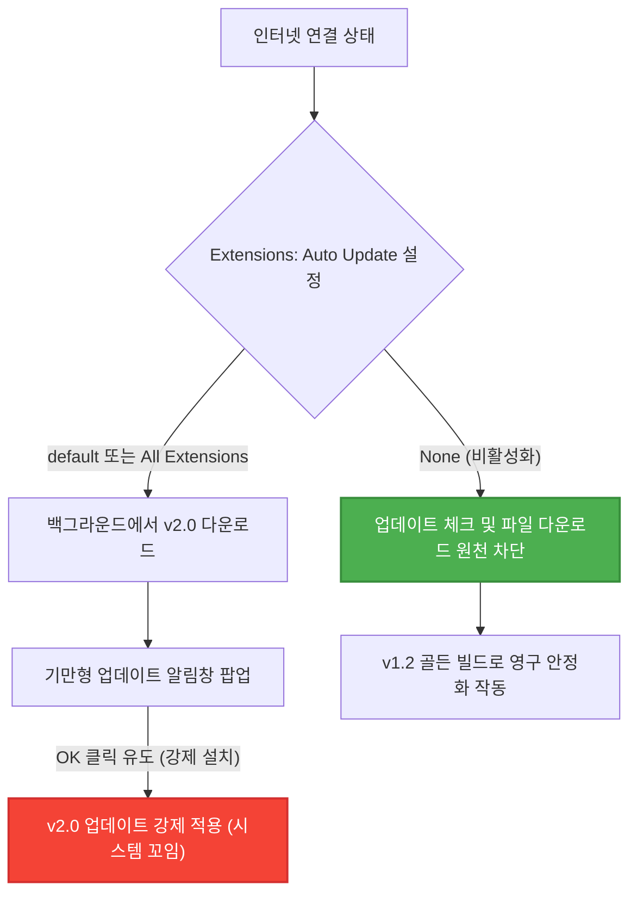

# 🛡️ AntiGravity v2.0 강제 업데이트 차단 및 최적 환경 고정 가이드 (VSOP)

> **[개요]**
> AntiGravity는 VS Code 편집 환경과 AI 엔진이 통합된 독립형 개발 환경(IDE)입니다. 기본 설정 상태에서는 백그라운드에서 마켓플레이스를 자동 스캔하여 **v2.0 최신 버전으로 강제 업데이트**를 시도하며, 이 과정에서 **"OK를 누르면 취소된다"는 직관에 반하는 경고창(Dark Pattern)**을 띄워 원치 않는 업데이트를 유발합니다. 
> 본 문서는 초보 개발자도 쉽게 따라 할 수 있도록 **가장 확실하고 안전하게 자동 업데이트를 차단하고 v1.2 골든 빌드로 고정하는 절차**를 안내합니다.

---

## 🗺️ 1. 메커니즘 도해 (How it Works)



---

## 🚨 2. 기만형(Dark Pattern) 업데이트 팝업 경고

> [!CAUTION]
> ### "OK를 누르면 취소된다"는 식의 알림창을 조심하세요!
> * **증상:** 사용 중 갑자기 우측 하단에 `AntiGravity 2.0` 설치 관련 팝업이 뜨며 **"OK를 누르면 설치가 취소된다"**는 뉘앙스의 교묘하게 꼬인 알림이 뜹니다.
> * **결과:** 절대 **[OK]를 누르시면 안 됩니다!** [OK]를 누르는 순간 v2.0 업데이트가 기습 설치되어 개발 환경이 망가집니다. 
> * **대처:** 해당 팝업이 뜰 경우 반드시 **[취소] 또는 [창 닫기]**를 눌러 회피하신 후, 아래의 차단 설정을 즉시 적용해 주셔야 합니다.

---

## 🛠️ 3. 단계별 설정 가이드 (Step-by-Step SOP)

아래의 절차대로 설정을 진행하면 번거롭게 랜선을 뽑거나 **비행기 모드**를 켤 필요 없이, 영구적으로 자동 업데이트를 막을 수 있습니다.

### 1단계: 설정(Settings) 창 열기
1. AntiGravity 편집기를 실행합니다.
2. 단축키 **`Ctrl + ,`**를 누르거나, 명령어 입력창(**`Ctrl + Shift + P`**)을 켜서 **`Open User Settings` (사용자 설정 열기)**를 선택합니다.

### 2단계: 최상위 Antigravity Settings 진입
1. 설정 창 오른쪽 위의 탭 영역에서 **`User`**나 **`Workspace`**가 아닌, 가장 강력한 **`Antigravity Settings` (Antigravity 설정)** 탭을 마우스로 클릭하여 선택합니다.
2. 검색창에 **`extensions auto update`**를 입력합니다.

### 3단계: 자동 업데이트 'None'으로 변경 (핵심 ⭐)
1. **`Extensions: Auto Update`** 항목을 찾습니다.
2. 기존에 `All Extensions` 또는 `Default`로 되어 있던 드롭다운 박스를 클릭하여 **`None` (없음)**으로 변경합니다.

---

## 🖼️ 4. 완벽하게 차단된 최종 설정 화면 캡처

아래 스크린샷과 같이 **드롭다운 설정 값이 `None`으로 박혀 있으면 완벽하게 조치 완료**된 상태입니다.


---

## 💡 5. 고급 개발자용 설정 (settings.json 직접 제어)

메뉴를 마우스로 클릭하는 대신, 설정 텍스트 파일에 한 줄의 코드로 못을 박아두고 싶은 개발자 분들은 아래와 같이 조치할 수 있습니다.

1. **`Ctrl + Shift + P`**를 누릅니다.
2. **`Preferences: Open User Settings (JSON)`**를 검색해 엽니다.
3. 설정 JSON 괄호 `{ }` 내부에 아래 코드를 삽입하고 저장(**`Ctrl + S`**)합니다.

```json
{
    "extensions.autoUpdate": "none"
}
```

---

> [!TIP]
> **본 가이드는 사용자님의 든든한 기술 인프라(Outputs/Obsidian)에 영구 통합되었습니다.**
> 이제 더 이상 윈도우 업데이트나 백그라운드 스캔으로 인해 AntiGravity의 세팅이 흐트러지는 일 없이, 가장 쾌적하고 강력한 v1.2 골든 빌드 환경을 유지하실 수 있습니다! 🚀