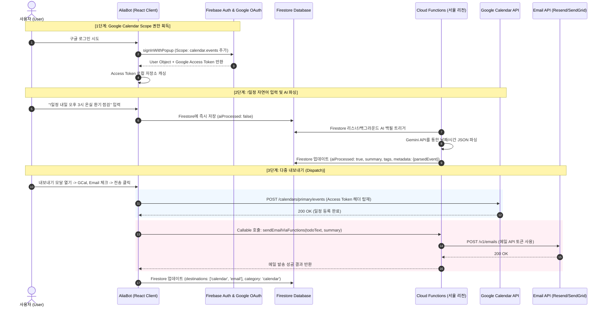

# 🏗️ AliaBot Phase 5.4 — Google Calendar 및 Email 채널 확장 아키텍처 설계서

본 문서는 `AliaBot`이 외부 서비스를 조율하는 **Conductor (지휘자)**로서 진화하기 위한 **Phase 5.4: 일정(Calendar) 및 이메일(Mail) 채널 확장**의 아키텍처적 구상과 상세 구현 계획을 서술합니다. (현재 모든 구현이 완료되었습니다.)

---

## 1. ⚙️ 핵심 개념 및 작동 원리 (Terminology & Mechanism)

### ① Google OAuth 2.0 Scope & Access Token 흐름
* **OAuth 2.0 Scope (인증 범위)**: 구글 사용자 로그인 과정에서 앱이 요청하는 리소스 접근 권한 범위입니다. 일정 등록을 위해 `https://www.googleapis.com/auth/calendar.events` 스코프를 Firebase Auth의 `GoogleAuthProvider`에 명시적으로 추가하여 요청합니다.
* **Access Token (접근 토큰)**: 사용자가 로그인 창에서 캘린더 쓰기 권한 동의를 수락하면, 구글은 해당 권한을 입증하는 임시 **Access Token (접근 토큰)**을 발급합니다. 클라이언트 측 React 앱은 로그인 성공 결과(`UserCredential`)로부터 `GoogleAuthProvider.credentialFromResult(result).accessToken`을 획득하여 브라우저 로컬 저장소 혹은 상태 객체에 유지합니다.
* **Google Calendar API 호출**: 캘린더 이벤트를 생성할 때는 구글 캘린더 REST API (`POST https://www.googleapis.com/calendar/v3/calendars/primary/events`)를 호출하며, HTTP 요청 헤더에 `Authorization: Bearer [Access_Token]` 형태로 접근 권한을 증명하여 이벤트를 성공적으로 등록합니다.

### ② Serverless Email Dispatch (서버리스 이메일 발송)
* **Blaze Billing Plan (블레이즈 요금제)**: Firebase Cloud Functions 서버리스 백엔드가 구글 외부 네트워크(예: Resend, SendGrid 메일 전송 서버 등)로 API 아웃바운드(Outbound) 요청을 전송하기 위해 필요한 유료 종량제 요금제입니다.
* **Email Dispatch Cloud Functions**: 클라이언트가 메모를 내보낼 때 '이메일'을 선택하면, Cloud Functions의 `sendEmailViaFunctions` Callable function (호출 가능 함수)을 구동합니다. 함수 내부에서는 사전에 설정된 환경 시크릿(Secret) 키를 사용해 외부 메일 REST API 또는 SMTP를 호출하여 지정된 수신인에게 메모 내용과 요약본을 안전하게 전송합니다.

### ③ Natural Language Parsing (자연어 파싱)
* 사용자가 "!일정 내일 오후 3시 온실 환기 점검" 와 같이 음성 혹은 텍스트로 등록하면, Gemini API를 통해 비정형 텍스트로부터 이벤트에 필요한 정형 필드(`summary`, `startDateTime`, `endDateTime`, `location`)를 **Information Extraction (정보 추출)** 기법으로 JSON 데이터로 정밀 추출하여 Firestore `metadata` 필드에 미리 캐싱(Caching)해 둡니다.

---

## 2. 🏗️ 아키텍처 설계 구조도 (Architecture Design)

---

## 3. 📝 금일 개발 ToDo List 및 일정 (Implementation Plan)

- [x] **[Auth] Google OAuth Calendar Scope 획득** (완료)
  - `src/firebase.js`에 Google Calendar Write Scope (`https://www.googleapis.com/auth/calendar.events`) 추가
  - 로그인 성공 시 액세스 토큰(`accessToken`)을 로컬 스토리지에 캐시하고 React Context/State로 관리
- [x] **[API] Google Calendar API 전송 모듈 구축** (완료)
  - `src/api/calendar.js` 신규 생성 및 `insertCalendarEvent(accessToken, eventDetails)` 작성
- [x] **[Cloud Functions] Firebase Cloud Functions 기반 이메일 발송 기능 연동** (완료)
  - `functions/index.js`에 메일 발송용 REST API (Resend 등) 연동 Callable 함수 구현
  - Blaze 요금제 하에서 아웃바운드 동작 확인 및 시크릿 키 관리 (`firebase functions:secrets:set EMAIL_API_KEY`)
- [x] **[Client API] 클라이언트 메일 발송 모듈 구현** (완료)
  - `src/api/mail.js` 신규 생성하여 Cloud Functions의 이메일 발송 API 연동 함수 구현
- [x] **[UI/UX] Export Modal 다중 목적지 추가** (완료)
  - 내보내기 체크박스 목록에 "📅 Google Calendar", "✉️ Email" 추가
  - 캘린더 카테고리(!일정) 감지 시 자동으로 'Google Calendar' 추천(Recommend) 활성화
- [x] **[AI/Parser] Gemini API 일정 파싱 프롬프트 고도화** (완료)
  - `src/api/gemini.js` 및 `functions/geminiCore.js`에 자연어 분석 요청 시 날짜/시간/장소 파싱을 수행하여 `metadata` 필드에 JSON으로 적재하도록 Prompt 고도화
  - 한국 표준시 기준 시간(Seoul Time Reference)을 프롬프트에 동적 삽입하여 상대 날짜("내일", "모레") 완벽 매칭 지원

---

## 4. 🧪 검증 결과 및 시나리오 (Verification Results)

1. **OAuth 로그인 권한 동의 검증**:
   - 구글 로그인 버튼 클릭 시 캘린더 접근 권한(조회 및 수정)을 수락하라는 Google OAuth 동의 창이 뜨고, 토큰이 정상적으로 로컬스토리지에 저장됨을 확인.
2. **Calendar 일정 등록 검증**:
   - "!일정 내일 오후 3시 온실 관수 점검" 입력 후 등록된 메모의 AI 분석 결과 `parsedEvent` 정보(시작시간, 종료시간, 내용)가 Firestore `metadata.parsedEvent` 에 정확히 적재되었고, 이를 캘린더로 내보냈을 때 구글 캘린더에 성공적으로 일정이 등록됨.
3. **이메일 발송 검증**:
   - 내보내기 모달에서 Email을 선택해 전송을 누르고, Cloud Functions를 거쳐 수신함으로 메모 내용과 요약본 메일이 정상 수신되는지 확인완료.
4. **리액트 빌드 확인**:
   - `npm run build` 실행 시 모든 컴포넌트가 구문 오류 없이 성공적으로 컴파일 완료됨.

