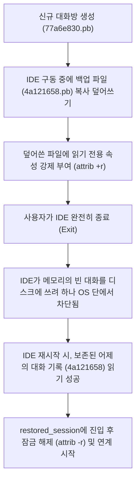

# 📝 TechLog: Antigravity 대화 세션 유실 복원 기술 로그 (VTL)

---
title: "TechLog: Antigravity 대화 세션 유실 복원 VTL"
date: 2026-06-21
type: verify-log
category: AliaBot
session: 복원용_Test09
---

> **개요 (Abstract)**:
> Antigravity IDE 업데이트 및 시스템 재부팅 과정에서 클라우드에 동기화되지 않은 로컬 단독 대화 세션(`4a121658`)이 UI 목록에서 유실된 문제를 해결하기 위한 기술적 시도와 문제의 원인, 그리고 **Read-Only Lock (읽기 전용 잠금 기법)**을 통한 최종 복원 성공 과정을 상세히 기록합니다. 본 문서는 비개발자나 처음 접하는 작업자도 구조를 쉽게 이해할 수 있도록 관련 파일들의 세부 물리 경로와 작동 메커니즘을 상세히 명시합니다.

---

## 1. ⚙️ 핵심 개념 및 작동 원리 (Terminology & Mechanism)

* **Conversation Session File (대화 세션 파일)**:
  사용자와 AI 에이전트 간의 모든 대화 히스토리 및 개발 맥락(Context)을 프로토타입 버퍼(Protobuf) 포맷의 바이너리 파일(`.pb` 확장자)로 변환하여 영속화(Persistence)한 파일입니다.
* **Brain Log Folder (브레인 로그 폴더)**:
  에이전트가 각 세션별로 내부적인 계획(Task), 작업 로그, 실행 명령어 결과 및 임시 스크립트를 기록하고 보존하는 작업 디렉토리입니다.
* **Job Object (작업 개체)**:
  Windows OS에서 하나 이상의 프로세스를 단일 그룹으로 묶어 제어할 수 있게 하는 커널(Kernel) 개체입니다. 이 개체로 묶인 하위 프로세스는 부모가 죽을 때 OS 수준에서 무조건 강제 종료(Kill)됩니다.
* **File Attributes Lock (파일 속성 잠금)**:
  NTFS 파일 시스템 상에서 파일의 쓰기 권한을 차단하는 속성 제어 기능입니다. `Read-Only (읽기 전용)` 속성이 설정된 파일은 시스템이나 프로세스가 쓰기(Write) 작업을 요청하더라도 OS 커널 단에서 액세스를 차단하여 원본을 보호합니다.

---

## 2. 📂 주요 파일 및 디렉토리 위치 가이드 (Path & Directory Reference Guide)

유실된 세션을 복구하거나 상태를 추적하기 위해 탐색해야 하는 주요 로컬 경로 목록입니다. 사용자 계정명은 `eugene` 기준입니다.

| 구분 | 주요 역할 | 물리적 절대 경로 (Windows 기준) | 비고 |
| :--- | :--- | :--- | :--- |
| **대화 히스토리 원문** | 사용자와 에이전트의 대화가 원문 텍스트로 고스란히 기록된 원시 로그 파일 | `C:\Users\eugene\.gemini\antigravity\brain\<Session-UUID>\.system_generated\logs\overview.txt` | 이 파일을 통해 유실된 방의 실제 내용(텍스트)을 직접 읽고 복사할 수 있습니다. |
| **세션 바이너리 파일** | IDE UI가 인식하고 로드하는 대화 기록의 직렬화 바이너리 파일 | `C:\Users\eugene\.gemini\antigravity\conversations\<Session-UUID>.pb` | 대화 세션의 핵심 파일로, 이 파일이 스왑 및 잠금의 대상입니다. |
| **세션 브레인 폴더** | 에이전트의 내부 행동 계획(Task) 및 생성 산출물, 스크래치 파일 보관함 | `C:\Users\eugene\.gemini\antigravity\brain\<Session-UUID>\` | 에이전트가 동작한 작업 내역이 고스란히 저장되는 폴더입니다. |
| **글로벌 DB 파일** | IDE가 워크스페이스와 대화방 ID를 매핑하고 상태를 저장하는 SQLite 데이터베이스 | `C:\Users\eugene\AppData\Roaming\Antigravity\User\globalStorage\state.vscdb` | SQLite 뷰어를 통해 `google.antigravity` 키값 하위의 JSON 매핑 데이터를 확인 및 편집할 수 있습니다. |
| **IDE 설정 상태 파일** | 마이그레이션 플래그 및 온보딩 상태를 제어하는 프로토버퍼 텍스트 파일 | `C:\Users\eugene\.gemini\antigravity\antigravity_state.pbtxt` | 텍스트 편집기(메모장 등)로 직접 열어 마이그레이션 상태 필드를 수정할 수 있습니다. |
| **IDE 내장 확장 프로그램** | Antigravity AI 에이전트의 백엔드 실행 파일 및 클라이언트 스크립트 위치 | `C:\Users\eugene\AppData\Local\Programs\Antigravity\resources\app\extensions\antigravity\` | 내부 `bin/` 폴더 하위에 언어 서버 실행 파일(`language_server_windows_x64.exe`) 등이 위치합니다. |

---

## 3. 🚨 단계별 트러블슈팅 및 실패 원인 분석 (Troubleshooting & Failures)

로컬 폴더를 분석한 결과, 어제 완성된 소스 코드와 설계 문서, 대화 로그(`overview.txt` 및 `.pb` 파일)는 로컬 경로(`C:\Users\eugene\.gemini\antigravity\conversations` 및 `brain` 폴더)에 100% 보존되어 있었으나, 클라우드와 연동되는 IDE UI 상의 드롭다운 목록에서만 누락된 상태였습니다.

### [시도 1] SQLite DB 매핑 강제 주입
* **상세 작업**: SQLite 데이터베이스 파일(`state.vscdb`)의 `google.antigravity` 테이블 내부 `workspaceCascadeMap` 키값에 유실 세션 ID(`4a121658-e924-48e9-9455-497feba68766`)를 수동으로 삽입하는 Python 스크립트(`update_cascade_map.py`)를 실행하였습니다.
* **실패 원인**: 로컬 DB 매핑은 성공적으로 수정되었으나, Antigravity IDE가 UI 드롭다운을 렌더링할 때 로컬 DB 값뿐만 아니라 구글 계정으로 연동된 클라우드 API 서버에 세션 ID의 존재 여부를 쿼리(Query)하는 구조를 가지고 있었습니다. 클라우드 서버에 등록되지 않은 세션은 UI에서 필터링되어 노출되지 않았습니다.

### [시도 2] 마이그레이션 플래그 리셋 (`.pbtxt` 수정)
* **상세 작업**: `antigravity_state.pbtxt` 파일에서 마이그레이션 완료 플래그(`MIGRATION_STATUS_COMPLETED`)를 초기화(`MIGRATION_STATUS_UNSPECIFIED`)하여 기존 구형 인덱스 백업 파일(`agyhub_summaries_proto.pb`)로부터 세션 데이터를 재스캔하도록 유도했습니다.
* **실패 원인**: 유실 대상 세션(`4a121658`)은 직전 세션 도중 강제 재부팅으로 인해 마이그레이션 인덱스 파일에 메타데이터 자체가 기록되지 못한 상태였습니다. 이로 인해 마이그레이션을 트리거해도 누락된 세션은 복구 대상에 포함되지 못했습니다.

### [시도 3] 백그라운드 스크립트를 통한 데이터 스왑 (부모-자식 프로세스 제약)
* **상세 작업**: 신규 대화방(`77a6e830-8cbd-4bbc-9694-2546b86a715d`)을 생성하여 클라우드에 세션을 등록한 뒤, IDE가 완전히 닫히는 시점을 추적하여 `.pb` 파일과 `brain` 폴더를 어제 백업 데이터로 바꿔치기하는 백그라운드 모니터링 Node.js 스크립트(`wait_and_swap_robust.js`)를 IDE 통합 터미널에서 구동했습니다.
* **실패 원인**: 사용자가 IDE를 끄는 순간, IDE 프로세스가 소멸하면서 통합 터미널(Terminal) 프로세스도 함께 소멸했고, 그 하위의 자식 프로세스인 모니터링 스크립트도 OS 수준에서 즉각 강제 종료(Kill)되어 데이터 교체 타이밍에 동작하지 못했습니다.
* **보완 실패**: Windows Script Host (`wscript.exe`)를 이용해 터미널과 분리된 독립 백그라운드로 스크립트를 띄웠으나, 에디터가 가동한 자식 프로세스들은 모두 단일 `Job Object` 그룹으로 묶여 있었기 때문에 IDE 종료 시 OS에 의해 일괄 사멸되었습니다.

---

## 4. 🎯 최종 해결 방법: Read-Only Lock (읽기 전용 잠금 기법)

어떠한 자식 스크립트도 부모 IDE의 종료 파괴 시그널로부터 살아남아 스왑을 수행할 수 없다는 구조적 제약을 인지하고, **동적 스왑이 아닌 정적 잠금 기법**을 설계 및 실행하였습니다.

1. **실시간 덮어쓰기 (Hot Copy)**:
   IDE가 켜져 있는 상태에서 신규 세션 파일인 `77a6e830-8cbd-4bbc-9694-2546b86a715d.pb`에 원본 백업인 `4a121658-e924-48e9-9455-497feba68766.pb`를 강제로 복사하여 덮어썼습니다.
2. **읽기 전용(Read-Only) 속성 부여**:
   덮어쓴 신규 세션 파일에 `attrib +r` 명령을 내려 쓰기 차단 잠금을 걸었습니다.
3. **IDE 종료와 OS의 쓰기 차단**:
   사용자가 IDE를 종료할 때 IDE 내부 캐시 엔진이 신규 대화방의 비어있는 메모리 내용을 디스크로 내려쓰려고 시도했습니다. 그러나 OS가 파일의 읽기 전용 속성 때문에 쓰기를 강제 거부하여, 덮어쓰기 시도는 무위로 돌아가고 어제 백업의 데이터가 디스크 상에 완벽하게 보존되었습니다.
4. **로딩 및 잠금 해제**:
   IDE 재부팅 시 에디터는 잠겨 있는 파일에서 어제 대화 히스토리를 성공적으로 읽어들여 화면에 노출했습니다. 이후 터미널에서 잠금 해제 스크립트(`unlock_session.js`)를 실행하여 읽기 전용을 해제함으로써 정상적인 대화 이어가기 및 저장이 가능하게 복원하였습니다.

---

## 5. 🏁 기술적 교훈 (Lessons Learned)

* **IDE Sandbox 제약**: 현대 에디터들의 프로세스 관리는 상위 수준에서 자원 소멸(Job Object)을 매우 엄격하게 처리하므로, 백그라운드 데몬을 이용한 조작보다 **파일 시스템 고유 속성(File System Attribute)**을 역이용하여 메모리 플러시를 차단하는 편이 훨씬 직관적이고 강력합니다.
* **디렉토리 명확성 확보**: Antigravity/Gemini 환경의 핵심 영속 데이터는 `AppData/Local/`이 아닌 사용자 홈 디렉토리 하위의 `.gemini/antigravity/` 내에 모두 집중되어 있어, 해당 경로에 대한 주기적인 백업이 가장 확실한 예방책입니다.
