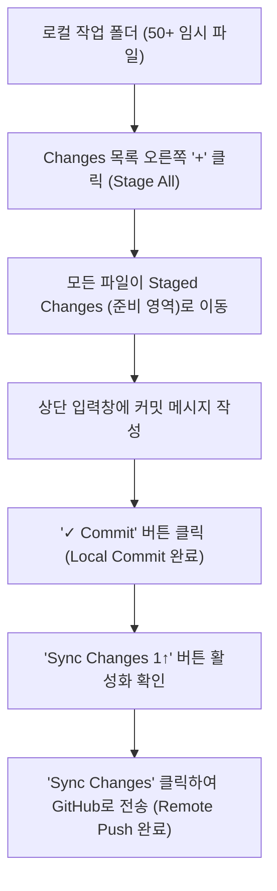

# 📝 TechLog: Antigravity IDE 환경에서의 Git 버전 관리 작동 원리 및 유실 방지 기술 로그 (VTL)

---
title: "TechLog: Antigravity IDE Git 버전 관리 및 로컬 백업 VTL"
date: 2026-06-23
type: verify-log
category: AliaBot
session: 복원용_Test09
---

> **개요 (Abstract)**:
> 프로젝트 개발 과정에서 에이전트와 사용자가 수정한 수많은 소스 코드와 문서 파일들이 로컬 작업 디렉토리에만 방치되어 유실 위험에 노출되었던 현상을 진단합니다. Antigravity IDE의 Git 소스 제어(Source Control) 패널의 시각적 요소(U, M, A 상태 태그 및 Commit Graph)의 의미와 작동 메커니즘을 규명하고, **로컬 커밋(Local Commit)**과 **원격 푸시(Remote Push)**의 기능적 물리적 차이를 분석하여 프로젝트의 최종 클라우드 백업을 달성하는 과정을 기록합니다.

---

## 1. ⚙️ 핵심 개념 및 작동 원리 (Terminology & Mechanism)

* **Git Status Tags (깃 상태 표시 태그)**:
  Git은 워크스페이스 내 파일들의 라이프사이클(Lifecycle)을 감지하고 상태를 다음과 같이 분류하여 UI 상에 단문 알파벳 태그로 노출합니다:
  * **`U` (Untracked - 추적되지 않음)**: Git이 파일의 존재는 인지했으나, 단 한 번도 커밋(Commit)에 포함된 적이 없는 신규 파일입니다. 버전을 기록하지 않으면 디스크 소실 시 복구가 불가합니다. (초록색 표시)
  * **`M` (Modified - 수정됨)**: 기존에 이미 커밋되어 추적(Tracked)되고 있는 파일이나, 마지막 커밋 이후 내용이 변경된 상태입니다. (주황색 표시)
  * **`A` (Added - 추가됨)**: `U` 상태였던 신규 파일이 사용자의 명시적인 스테이징(Staging) 작업을 거쳐 다음 커밋에 포함되도록 준비된 상태입니다. (노란색 표시)
* **Local Commit (로컬 커밋)**:
  내 컴퓨터 내부의 비밀 금고(`.git/` 폴더)에만 버전의 스냅샷(Snapshot)을 저장하는 행위입니다. 인터넷이 연결되지 않은 오프라인 상태에서도 수행할 수 있어 매우 빠르고 유연하지만, 내 컴퓨터의 물리적 저장장치가 손상되면 데이터가 함께 소실됩니다.
* **Remote Push (원격 푸시)**:
  내 로컬 컴퓨터 금고에 쌓아둔 커밋 기록들을 인터넷 망을 통해 원격 서버(원격 저장소, GitHub)로 업로드하여 동기화하는 행위입니다. 이 단계를 완료해야 비로소 전 세계 어디서나 백업 코드를 복구할 수 있는 클라우드 안전망이 확보됩니다.
* **Sync Changes (변경사항 동기화)**:
  IDE UI의 Git 소스 제어 패널에서 제공하는 통합 단추입니다. 원격 저장소로부터 새로운 내용을 가져오는 `Pull` 작업과 로컬의 새로운 커밋을 원격에 올리는 `Push` 작업을 한 번에 안전하게 수행해 줍니다.

---

## 2. 🚨 코드 현황 진단: 왜 50여 개의 파일이 누적되어 있었는가?

1. **에이전트의 커밋 제한 원칙**:
   * 이전 에이전트들이 일부 완성된 개발 마일스톤(Milestone) 단위에서는 터미널 명령(`git commit`)을 통해 커밋을 직접 수행하기도 했습니다. (이 흔적은 `Graph` 영역의 파란 점들로 확인됩니다.)
   * 그러나 파일 생성이나 세션 종료 시마다 커밋을 자동 실행하면 원치 않는 오류 코드나 미완성 작업까지 검토 없이 버전에 섞이게 되므로, 에이전트는 기본적으로 수정한 파일을 작업 디렉토리에 그대로 남겨둔 채 대화를 종료합니다.
2. **장기 방치 및 유실 위험**:
   * 지난 4월부터 누적된 다수의 설계 문서(`.md`)들이 `U` (Untracked) 상태로 존재했던 것은, 생성 이후 한 번도 `git add` 및 `git commit`을 통해 버전 데이터베이스에 편입시키지 않았기 때문입니다.
   * 이상태에서 로컬 디스크 장애가 발생하면 복구가 불가한 위험(망패)에 처할 수 있으므로, 반드시 로컬 커밋을 거쳐 원격 GitHub에 푸시하여 격리 보관해야 합니다.

---

## 3. 🎯 해결 방향: 시각적 스테이징 및 최종 원격 푸시

IDE의 Git UI 패널을 이용하여 변경사항을 스테이징하고, 로컬 커밋 및 원격 전송까지 순차적으로 진행하는 통합 파이프라인을 구축합니다.

* **Staged Changes에 1개가 미리 가있던 이유**:
  `Docs/20260621_AliaBot_Convo_Session_Restore_VTL.md` 파일이 이미 `Staged Changes`에 노출되어 있었던 것은, 이전 세션의 마지막 단계에서 해당 파일 생성 시 사용자가 직접 해당 파일의 `+` 버튼을 클릭했거나 스크립트 실행 과정에서 명시적으로 스테이징 영역에 편입되었기 때문입니다.
* **최종 조치**:
  수동으로 모든 변경 파일을 장바구니에 담고, 메시지(`Docs: AliaBot 개발/복원 문서 통합 및 프로젝트 정상 상태 백업`)와 함께 로컬 커밋을 실행한 후, `Sync Changes` 버튼을 눌러 GitHub 원격 서버에 최종적으로 푸시합니다.
