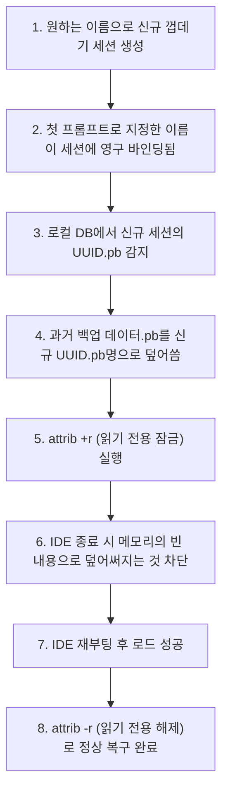

# 📝 TechLog: Antigravity UI 대화 세션 명칭 정책 및 맥락 제어 기술 로그 (VTL)

본 기술 로그(Visual Tech Log)는 Antigravity 클라이언트 UI의 최근 설계 업데이트 사항인 **대화 세션 수동 명칭 변경 차단**의 아키텍처적 원인과, 이를 보완하고 효율적으로 제어하기 위한 **Global Settings (전역 설정) 및 Context-Specific Menu (맥락 특정 메뉴)**의 내부 동작 메커니즘을 상세히 기록합니다.

---

## 1. ⚙️ 핵심 개념 및 작동 원리 (Terminology & Mechanism)

### ① Global Settings (전역 설정) vs Context-Specific Menu (맥락 특정 메뉴)
* **Global Settings (전역 설정)**:
  - **정의**: 개발 도구 애플리케이션 전체에 영향을 미치는 시스템 환경 매개변수를 제어하는 최상위 옵션 창입니다.
  - **작동 원리**: 대화 기록(History) 패널 상단의 `...` 메뉴를 통해 노출되는 `Customization`, `MCP Servers`, `Expert` 등이 이에 속합니다. 이러한 전역 설정값들은 개별 대화방(Session)을 전환하거나 삭제하더라도 에디터 백엔드의 글로벌 스토리지 DB에 캐싱(Caching)되어 영구 보존됩니다.
* **Context-Specific Menu (맥락 특정 메뉴)**:
  - **정의**: 현재 활성화되어 있는 단 하나의 대화 세션(대화방) 내부의 상태 및 맥락(Context)을 제어하는 제어판입니다.
  - **작동 원리**: 대화 패널 하단의 세션 삭제(휴지통 아이콘), 메시지 개별 복사 및 텍스트 편집 등의 기능이 포함됩니다. 활성 대화방을 변경하면 대상 세션의 ID(UUID)에 종속된 데이터 테이블로 호출 대상이 동적 전환됩니다.

### ② Auto-titling Policy (자동 타이틀 명명 정책)
* **정의**: 사용자가 별도로 대화방 제목을 짓지 않아도, 대화 시작과 동시에 입력된 첫 질문을 바탕으로 AI가 맥락을 요약하여 고유 세션명으로 지정하고 데이터베이스에 바인딩(Binding; 묶기)하는 자동화 규칙입니다.
* **작동 원리**: 첫 프롬프트(First Prompt)가 전송되면, 백그라운드에서 임시 타이틀 요약 API가 실행됩니다. 문장의 구조 분석을 거쳐 핵심 주제를 대표 텍스트로 추출한 뒤, 로컬 세션 메타데이터에 즉각 덮어쓰고 화면 UI를 새로 고칩니다.

---

## 2. 🚨 대화 세션 수동 편집(Rename) 차단 히스토리 분석

### ① 수동 변경 비활성화(Disabled) 시점 및 배경
* **변경 시점**: 2026년 6월 초순경 자동 업데이트 패치(Auto-update Patch)를 통해 적용되었습니다.
* **아키텍처적 문제 원인**:
  1. **Cloud Sync Synchronization Error (클라우드 동기화 불일치 오류)**: 사용자가 로컬 UI 상에서 이름을 강제로 수동 편집했을 때, 클라우드 백엔드 인덱스 서버에 저장되어 있는 요약 메타데이터 명칭과 키값의 싱크(Sync)가 어긋나며 좌측 대화 히스토리 목록에서 세션 전체가 누락(Orphaned Convo)되는 버그가 다수 보고되었습니다.
  2. **Concurrency Issue (동시성 충돌)**: 로컬 파일에 임시 데이터를 쓰고 있는 도중 사용자가 타이틀을 동시에 고치는 과정에서, 파일 시스템 잠금(Lock) 충돌로 인해 대화 기록(`.pb` 파일) 자체가 손상(Corruption)되는 리스크가 존재했습니다.
* **현재의 규격**: 이에 따라 시스템은 안정성을 최우선으로 확보하기 위해 연필(✏️) 수정 아이콘과 더블 클릭 편집 동작을 완전히 제거하고 **Read-Only (읽기 전용)** 자동 제목 정책으로 강제 정규화하였습니다.

---

## 3. 🎯 대화방 분류 및 일련번호 일치 전략 (Workflow Strategy)

사용자가 수동으로 세션명을 바꿀 수 없는 제약 환경에서, 프로젝트 분류 및 흐름을 순차적으로 시각화하기 위해 아래와 같은 **접두사 명명 규칙(Prefix Strategy)**을 사용합니다.

```
[첫 질문 입력창]
" [일련번호/Phase] + [프로젝트 분류] + [핵심 개발 주제] " 형태로 시작
```

### 📌 접두사 명명 포맷 템플릿
* **A안 (대괄호 + 단계 번호 조합)**:
  > `[Phase 5.5 - 01] AliaBot Obsidian 연동 고도화 개발을 시작합시다.`
  > - *결과*: **`[Phase 5.5 - 01] AliaBot Obsidian...`** 으로 제목 고정.
* **B안 (숫자 번호 접두사 방식)**:
  > `02. [AliaBot Phase 5.5] Notion API 동기화 필드 업데이트 및 검증`
  > - *결과*: **`02. [AliaBot Phase 5.5] Notion...`** 으로 제목 고정.

---

## 4. 🛠️ 물리 파일 속성 제어 복원(Data Swap Lock)의 기술적 조명
수동 편집 기능이 상실된 시점에서, 꼭 필요한 경우 과거 데이터의 제목을 강제로 이식하여 복원할 때 사용하는 파일 속성 제어 기법의 메커니즘을 규명합니다.



* **핵심 원리**: 부모 프로세스(IDE) 종료 시 실행되는 모든 메모리 동기화 로직은 NTFS 파일 시스템 레벨에서 부여한 **읽기 전용 속성 잠금(`attrib +r`)**을 뚫고 데이터를 쓸 수 없습니다. 이로 인해 임시 데이터로 덮어써지지 않고 과거 백업 데이터가 안전하게 강제 이식(Data Swap)되는 기술적 우회로가 성립합니다.
