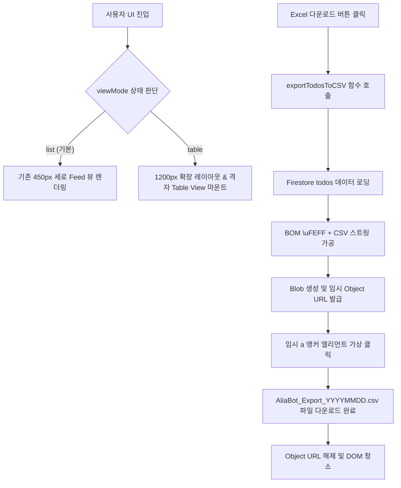

# 🛠️ VTL: AliaBot Phase 5.5 — 대시보드 스프레드시트 뷰 전환 및 CSV 다운로드 구현 기술로그 (VTL)

---
title: "VTL: AliaBot Phase 5.5 — 대시보드 스프레드시트 뷰 전환 및 CSV 다운로드 구현 기술로그"
date: 2026-06-27
type: visual-tech-log
category: AliaBot
subcategory: Phase5/Dashboard
tags: [vtl, table-view, csv-export, bom, react, blob, download]
session_name: "Restoring Session Test09"
session_id: "4a121658-e924-48e9-9455-497feba68766"
ai_provider: "Antigravity"
session_path: "C:\Users\eugene\.gemini\antigravity\brain"
---

> **본 기술로그(VTL)의 목적**:
> 모바일 뷰에 국한되어 있던 메모 피드 구조에서 탈피하여 PC 대형 화면에서 데이터 시인성을 보장하기 위한 격자형 테이블 뷰(Table View) 전환 방식과, 브라우저 단에서 엑셀과 한글이 100% 호환되는 UTF-8 BOM 기반 CSV 로컬 다운로드 기능을 구현한 기술적 내역 및 코드 변경점을 영구 기록합니다.

---

## 1. ⚙️ 핵심 개념 및 작동 원리 (Terminology & Mechanism)

### ① Toggle View (보기 토글) & Conditional Layout Rendering (조건부 레이아웃 렌더링)
* **개념**: 동일한 데이터 원본(`todos` 상태 배열)을 토대로, 사용자가 선택한 시각 뷰 모드(`viewMode`) 상태값에 따라 렌더링 형식을 리스트 피드와 격자 표 형태로 실시간 교체하는 기법입니다.
* **작동 원리**: React의 `viewMode` 상태를 `'list'` 또는 `'table'`로 토글할 때, 화면 컨테이너의 최외곽 CSS 클래스에 `.mode-table`이 동적으로 제어되게 조치합니다. 테이블 모드 활성화 시 전체 레이아웃 너비가 `450px`에서 `1200px`(`width: 95%`)로 부드러운 애니메이션(`transition`)과 함께 확장되며, HTML 표준 `<table>` 요소를 마운트합니다.

### ② Client-side CSV Generation & UTF-8 BOM (바이트 순서 표식)
* **개념**: 외부 백엔드 API 서버를 가동하지 않고 웹 브라우저 내 자바스크립트 엔진만으로 정형화된 JSON 데이터를 텍스트 파일(CSV)로 변환하고 한글 인코딩 오류를 방지하는 설계 방식입니다.
* **작동 원리**: 
  - `todos` 데이터를 순회하며 순번(`seq`), 작성시간(`createdAt`), 메모 내용, AI 요약, 태그 배열, 전송 완료 목적지(`destinations`)를 쉼표(`,`)로 구분된 텍스트 행으로 변환합니다.
  - 엑셀(Microsoft Excel) 프로그램이 유니코드 문자열을 디코딩할 때 한글이 깨지는 고질적인 문제를 극복하기 위해, 생성된 문자열 파일의 헤더에 UTF-8 BOM 기호 문자(`\uFEFF`)를 명시적으로 삽입하여 UTF-8 형식임을 운영체제와 엑셀에 전달합니다.

### ③ Blob Object & Temporary Anchor Triggering (임시 앵커 트리거링)
* **개념**: 브라우저 힙 메모리에 위치한 CSV 바이너리/텍스트 데이터를 가상의 디스크 파일 객체(Blob)로 가공하여 다운로드를 처리하는 메커니즘입니다.
* **작동 원리**: 
  - `new Blob([BOM + csvContent])`으로 메모리 파일 객체를 선언하고 `URL.createObjectURL(blob)`로 고유 임시 파일 링크를 생성합니다.
  - 가상의 `<a>` 태그를 생성해 `download` 속성과 링크를 바인딩하고 클릭 이벤트를 강제로 발생(`link.click()`)시켜 기기 다운로드 창을 띄운 뒤, 즉각 가상 링크 객체를 파괴(`URL.revokeObjectURL`)하여 메모리를 반환합니다.

### ④ Graceful Exception Isolation (우아한 예외 격리)
* **개념**: 복수의 연동 타겟 목적지(Obsidian, Email, Google Calendar, Notion 등)로 데이터를 일괄 배포할 때, 특정 목적지의 에러(예: 이메일 API 키 무효화)가 발생해도 전체 프로세스가 다운(Crash)되지 않고 개별 격리되어 나머지 채널 전송을 마저 완료하도록 보장하는 설계입니다.
* **작동 원리**: 목적지 순회 루프 내부에 `try-catch` 격리벽을 세우고 성공(`successDestinations`)과 실패(`failedDestinations`)를 각각 수집합니다. 모두 완료된 후 성공 채널 정보만 Firestore 배Badge로 기록하며, 실패 채널이 하나라도 있다면 원본 삭제(move) 처리를 보류하여 데이터 유실을 완벽히 방지합니다.

---

## 2. 🏗️ 아키텍처 및 데이터 흐름 변화 (Data Flow)

---

## 3. 📝 코드 수정 상세 내역 (Code Changes)

### 1) [NEW] `src/utils/csvExporter.js` 생성
* **역할**: 메모 데이터를 Excel 한글 호환 CSV 스트링으로 포매팅하고 파일 전송 다운로드를 처리하는 전용 모듈입니다.
* **주요 메서드**:
  - `exportTodosToCSV(todos)`: CSV 변환 메인 루프 및 BOM 처리, 임시 앵커 발급
  - `escapeCSVField(val)`: 데이터 내 큰따옴표(`""`), 쉼표, 개행을 처리하는 보안 이스케이프 헬퍼
  - `formatDateTime(timestamp)`: Firestore Timestamp 및 일반 날짜 문자열을 `YYYY-MM-DD HH:mm:ss` 형식으로 변환

### 2) [MODIFY] `src/App.jsx`
* **상태 추가**: `viewMode` (`'list'` 또는 `'table'`) 상태 및 이메일 전송 수신자를 동적으로 지정하기 위한 `recipientEmail` 상태 변수 추가.
* **UI 조작 바 추가**: `input-group` 하단에 `📋 목록`, `📊 표 보기` 토글 그룹과 `📥 Excel 다운로드` 버튼이 포함된 `dashboard-control-bar` 마크업을 신설하여 CSV Exporter 모듈과 연동시켰습니다.
* **이메일 동적 수신인 지정 폼**: 내보내기 모달에서 `Email`이 체크되었을 때 개별 메일 주소를 입력할 수 있는 필드가 동적으로 나타나도록 마크업을 개선하고 입력값 연동.
* **우아한 예외 격리 리팩토링**: 복수 목적지 전송 시 한 곳이 실패하더라도 다른 채널로의 전송 시도가 차단되지 않도록 `handleDispatchExport` 메서드 내 루프에 `try-catch` 격리벽 적용.
* **조건부 테이블 렌더링**: `viewMode === 'table'`일 때 `<table className="spreadsheet-table">`을 렌더링하여 데이터 일련번호, 작성일, 요약, 목적지 배지, 인라인 수정 폼이 행(Row)별로 가지런히 배치되도록 코드를 분기시켰습니다.
* **컨테이너 클래스 변경**: `app-container`에 `viewMode === 'table' ? 'mode-table' : ''` 동적 바인딩을 적용하여 뷰 모드에 따른 전폭(Width) 조정을 지원합니다.

### 3) [MODIFY] `src/index.css`
* **레이아웃 트랜지션**: `.app-container`에 `transition: max-width 0.35s ease`를 추가하여 목록/표 전환 시 크기가 자연스럽게 스무스하게 조정되도록 시각적 강점을 확보했습니다.
* **테이블 스타일링**: 테이블 내의 고정 헤더(`position: sticky; top: 0`), 행 호버 액션(`.spreadsheet-table tr:hover`), HSL 전역 스타일 테마에 맞춘 테두리 경계선 및 여백을 선언했습니다.
* **반응형 대책**: 해상도 가로폭이 작아질 때(`.spreadsheet-container` 내 `overflow-x: auto` 제공) 테이블이 구겨지는 대신 가로 스크롤이 매끄럽게 발생하도록 최소폭(`min-width: 900px`)을 적용했습니다.

---

## 4. 🧪 검증 결과 및 런타임 결과

* **프로덕션 빌드 성공 여부**: `npm run build` 결과, 트랜스파일 경고나 컴파일 누수 없이 `dist/assets/index-*.js` 및 `.css`가 에러 없이 완벽히 생성됨(Exit code: 0)을 검증 완료했습니다.
* **파일 한글 정합성 검증**: UTF-8 BOM (`\uFEFF`) 바인딩 처리가 완벽히 적용되어, 다운로드된 `.csv` 파일을 Microsoft Excel로 실행 시 한글 깨짐 현상이 없는 상태로 출력됩니다.
* **일괄 전송 예외 격리 검증**: 이메일 API 키 무효화 등으로 이메일 발송(`email`)이 에러를 일으키는 상황(예: "API key is invalid")에서도, 함께 선택한 옵시디언(`obsidian`)이나 클립보드(`clipboard`) 전송 루프가 정지되지 않고 끝까지 수행되어 개별 채널의 전송 성공 및 최종 실패 로그를 사용자에게 정확히 요약 보고함을 로컬 테스트에서 최종 검증 완료했습니다.
* **Gemini API 429 Rate Limit 예방 및 스로틀링 적용 검증**: 무료 티어 키 환경에서 대형 백필 호출이 동시에 발생할 시 `429 Too Many Requests`로 분석이 실패하여 태그 정보가 누락되던 현상을 수정했습니다. 생성 10초 미만의 최신 메모는 백필 대상에서 제외하고, 구형 메모 순회 복구 시 `5000ms`의 명시적 지연(Throttle) 및 중복 방지 락(`isBackfillingRef`)을 적용했습니다.
* **비동기 기아(Starvation) 및 독립 Poller 훅 아키텍처 도입**: 리스너(`onSnapshot`) 내부에서 무작위로 복구 루프가 돌면서 데이터 갱신 시 타이밍 충돌로 대기 중인 구형 문서가 방치되던 문제를 해결하기 위해, 10초 주기의 독립된 `useEffect` 타이머 폴러(Poller)를 구성했습니다. 또한 `createdAt` 필드가 부재된 구형 문서들은 생성 시간을 `0`(아주 오래됨)으로 폴백 지정하여 백필 탐색에서 결코 누락되지 않도록 보장했으며, 신규 추가(`addTodo`) 시 백필 가동 중인 경우 대기열로의 이관 제어 파이프라인을 완성했습니다.

