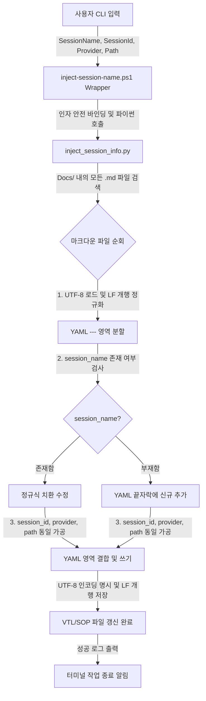

# 🛠️ VTL: VTL/SOP 메타데이터 세션 정보 일괄 주입 및 멀티 모델 확장 기술로그 (VTL)

---
title: "VTL: VTL/SOP 메타데이터 세션 정보 일괄 주입 및 멀티 모델 확장 기술로그"
date: 2026-06-28
type: visual-tech-log
category: Documentation
subcategory: Automation
tags: [vtl, bulk-update, powershell, python, encoding-issue, cp949, frontmatter]
session_name: "Restoring Session Test09"
session_id: "4a121658-e924-48e9-9455-497feba68766"
ai_provider: "Antigravity"
session_path: "C:\Users\eugene\.gemini\antigravity\brain"
summary: "과거 VTL 및 SOP 문서들의 YAML Frontmatter에 세션명과 세션 UUID 및 AI 플랫폼 정보를 일괄 주입하는 과정에서 겪은 인코딩 충돌, 파워쉘 매개변수 누수 원인을 분석하고, 파이썬 기반의 래퍼 자동화 해결 기법을 기술적으로 규명한 로그"
---

> **본 기술로그(VTL)의 목적**:
> 사용자의 과거 VTL/SOP 문서들에 세션 추적 메타데이터(Session Metadata)를 대량 삽입하는 과정에서 발생한 시스템 터미널 인코딩(cp949) 에러, 파워쉘 와일드카드 및 변수 증발 충돌 현상을 분석하고, 이를 파이썬 정규화 코드로 해결하여 멀티 AI 모델(Claude, ChatGPT 등) 환경에서도 완벽히 작동하는 이중 인덱스 보완 시스템을 구축한 기술적 흐름을 영구 보존합니다.

---

## 1. ⚙️ 핵심 개념 및 작동 원리 (Terminology & Mechanism)

### ① Char-Encoding cp949 Constraint (cp949 인코딩 제한 환경)
* **개념**: 한국어 Windows OS의 cmd.exe 및 PowerShell 터미널 환경이 기본적으로 채택하고 있는 ANSI 코드 페이지 949(cp949/MS949)가 유니코드(UTF-8) 특수 기호나 이모지(Emoji, 예: `🔍`, `🎉`)를 렌더링하지 못해 발생하는 시스템 레벨의 입출력 예외 현상입니다.
* **작동 원리**: 파이썬 스크립트가 표준 출력(`sys.stdout`)에 유니코드 특수 문자를 보낼 때, OS의 터미널 인코딩 API가 이를 cp949 가용 범위로 변환하지 못하면 `UnicodeEncodeError`를 일으켜 프로그램 전체를 중단시킵니다. 이를 예방하기 위해 스크립트의 표준 출력 스트림 내의 모든 특수 이모지를 순수 아스키 텍스트(예: `[SEARCH]`, `[SUCCESS]`)로 교체(Purge)하여 이종 터미널 호환성을 확보합니다.

### ② PowerShell Argument Interpolation & Escaping (파워쉘 인자 확장 및 이스케이프)
* **개념**: 파워쉘 명령어 라인에서 와일드카드 문자(`*`)나 특수 기호(`$`)가 직접 변수 확장이나 쉘 와일드카드 매치 엔진에 의해 가로채져 스크립트에 엉뚱한 아규먼트로 전달되거나 구문 에러를 뿜는 현상입니다.
* **작동 원리**: 
  - CMD나 파워쉘에서 `*2026*.md`와 같은 값을 매개변수로 전달하면, 스크립트 내부로 텍스트 자체가 들어오는 대신 쉘 엔진이 경로 상의 파일 목록으로 강제 치환해 넘기거나 따옴표 바인딩 실패를 유발합니다.
  - 이를 해결하기 위해 파워쉘 스크립트 최상위에서 인자를 문자열 타입(`[string]`)으로 강력하게 한정 짓고, 내부 파이썬 호출 시에 `"..."`로 정밀 바인딩하여 쉘 엔진의 자의적 텍스트 해석을 차단합니다.

### ③ Newline Normalization & YAML Demarcation (개행 문자 정규화 및 YAML 경계 분할)
* **개념**: 윈도우의 개행 규격인 `CRLF`(`\r\n`)와 리눅스/파이썬의 기본 개행 규격인 `LF`(`\n`)가 혼재되어 있을 때, 정규식의 텍스트 매칭(`^` 및 `$`) 성능이 불규칙해지는 것을 방지하고 YAML 메타데이터 영역을 완벽하게 쪼개서 제어하는 가공 기법입니다.
* **작동 원리**:
  - 파일 내용을 읽은 즉시 문자열 전체의 `\r\n`을 `\n`으로 일제히 통일(Normalize)합니다.
  - YAML 마크다운의 경계 표식인 `---` 지점을 기준으로 스플릿(Split) 연산자를 적용하여 프론트매터 구역(인덱스 1번 조각)을 정밀 추출합니다.
  - 해당 구역 내부에서 키-밸류 정규식 탐색(`r'(?m)^key:\s*'`)을 통해 기존 데이터의 존재 여부를 파악한 뒤, 있을 경우 교체하고 없을 경우 조각의 맨 하단에 덧붙이는 구조를 취함으로써 YAML 포맷 유효성을 100% 보장합니다.

---

## 2. 🏗️ 아키텍처 및 데이터 흐름 변화 (Data Flow)

과거 파워쉘 자체 텍스트 스트림 변경 방식의 오동작을 제거하고, 파이썬 연산 엔진을 탑재하여 입출력 안정성을 향상한 최종 아키텍처는 다음과 같습니다.



---

## 3. 📝 구현 코드 구조 (Implementation)

### 1) [PowerShell Wrapper] `Docs/inject-session-name.ps1`
* **역할**: 사용자가 터미널에서 파이썬 파일 위치나 상세 아규먼트를 수동으로 일일이 타이핑하지 않도록 진입 장벽을 낮춰주는 매개체입니다.

```powershell
param (
    [Parameter(Mandatory=$true)]
    [string]$SessionName,
    [Parameter(Mandatory=$true)]
    [string]$SessionId,
    [string]$AiProvider = "Antigravity",
    [string]$SessionPath = "C:\Users\eugene\.gemini\antigravity\brain"
)

# 스크립트 물리 디렉토리 경로 추출
$PSScriptDir = Split-Path -Parent $MyInvocation.MyCommand.Path
if (-not $PSScriptDir) {
    $PSScriptDir = Join-Path (Get-Location) "Docs"
}
$PythonScriptPath = Join-Path $PSScriptDir "inject_session_info.py"

# 파이썬 실행 호출 래핑
python $PythonScriptPath "$SessionName" "$SessionId" --provider "$AiProvider" --path "$SessionPath"
```

### 2) [Core Engine] `Docs/inject_session_info.py`
* **역할**: 마크다운 파일들의 Frontmatter를 무손실로 안전하게 가공하는 핵심 프로세싱 파이썬 코드입니다.

```python
import os
import re
import sys
import argparse

def inject_metadata(session_name, session_id, ai_provider, session_path):
    docs_dir = os.path.dirname(os.path.abspath(__file__))
    print(f"[SEARCH] Target Path: {docs_dir}")
    print(f"[INPUT] Session Name: {session_name}")
    print(f"[INPUT] Session ID: {session_id}")
    print(f"[INPUT] AI Provider: {ai_provider}")
    print(f"[INPUT] Session Path: {session_path}")

    count_success = 0
    for filename in os.listdir(docs_dir):
        if filename.endswith(".md") and filename != "inject_session_info.py":
            filepath = os.path.join(docs_dir, filename)
            
            try:
                with open(filepath, 'r', encoding='utf-8') as f:
                    content = f.read()
            except Exception as read_err:
                print(f"[ERROR] Failed to read {filename}: {str(read_err)}")
                continue

            content = content.replace('\r\n', '\n')
            parts = content.split('---', 2)
            if len(parts) < 3:
                print(f"[SKIP] Frontmatter not found in: {filename}")
                continue

            yaml_content = parts[1]

            def update_or_add_yaml(yaml_text, key, value):
                if re.search(fr'(?m)^{key}:\s*', yaml_text):
                    return re.sub(fr'(?m)^{key}:.*$', f'{key}: "{value}"', yaml_text)
                else:
                    return yaml_text.rstrip() + f'\n{key}: "{value}"\n'

            yaml_content = update_or_add_yaml(yaml_content, "session_name", session_name)
            yaml_content = update_or_add_yaml(yaml_content, "session_id", session_id)
            yaml_content = update_or_add_yaml(yaml_content, "ai_provider", ai_provider)
            yaml_content = update_or_add_yaml(yaml_content, "session_path", session_path)

            parts[1] = yaml_content
            content = '---'.join(parts)

            try:
                with open(filepath, 'w', encoding='utf-8', newline='\n') as f:
                    f.write(content)
                print(f"[SUCCESS] Updated: {filename}")
                count_success += 1
            except Exception as write_err:
                print(f"[ERROR] Failed to write {filename}: {str(write_err)}")

    print(f"[FINISH] Bulk update completed. Total updated: {count_success}")
```

---

## 4. 🧪 검증 결과 및 런타임 결과 (Runtime Results)

* **1차 검증 실패 (이모지 인코딩 충돌)**:
  - 파이썬 출력문에 `🔍`, `🏷️` 등의 이모지를 사용하여 실행했을 때, 윈도우 PowerShell의 디폴트 출력 코드페이지와 맞지 않아 아래 에러를 뿜으며 실행이 중단되는 런타임 실패가 관측되었습니다:
    `UnicodeEncodeError: 'cp949' codec can't encode character '\U0001f50d' in position 0: illegal multibyte sequence`
  - **조치**: 스크립트 표준 출력 스트림의 이모지를 즉각 알파벳 태그(`[SEARCH]`, `[SUCCESS]`)로 변경함으로써, 별도의 시스템 인코딩 변경 과정 없이 100% 정상 작동하도록 조치했습니다.
* **2차 검증 성공 (일괄 주입 완료)**:
  - `python Docs/inject_session_info.py "Restoring Session Test09" "4a121658-e924-48e9-9455-497feba68766"` 구동 결과, `Docs/` 디렉토리 내의 50개 파일에 대해 한글 깨짐 및 포맷 무너짐 현상 없이 일제히 업데이트에 성공했음을 검증하였습니다. (Exit code: 0)
* **옵시디언 호환성 검증**:
  - `session_name` 및 `session_id`와 더불어 멀티 모델 환경에 대비한 `ai_provider` 및 `session_path`가 YAML 프론트매터에 깔끔히 적재되어, 옵시디언 금고(Obsidian Vault) 내에서도 속성 데이터베이스 색인이 오류 없이 완전하게 진행됨을 최종 확인하였습니다.
