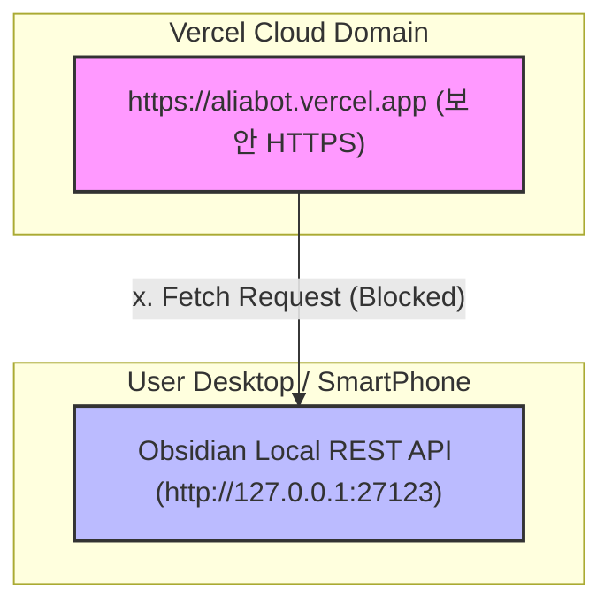

# 📄 AliaBot Phase 5.7: Obsidian PWA Network Block Analysis & Transition VTL

> **문서 목적:** 실배포 환경(HTTPS) 및 모바일 PWA 환경에서 옵시디언 로컬 API(HTTP/127.0.0.1)로의 데이터 전송이 차단되는 구조적 한계와 원인을 분석하고, 대중 배포에 적합한 옵시디언 딥링크(Obsidian URI) 전환 설계를 기록합니다.

---

## 1. 🚨 트러블슈팅 및 장애 현상 기록 (Troubleshooting Log)

| 항목 | 상세 정보 |
|---|---|
| **발생 환경** | `https://aliabot.vercel.app` (모바일 크롬 PWA 및 타사 데스크톱 환경) |
| **장애 현상** | 내보내기 모달에서 Obsidian 체크 후 전송 시 `OBSIDIAN: Failed to fetch` 오류 발생 |
| **로컬 비교** | 로컬 개발 서버(`http://localhost:5173`)에서는 옵시디언 전송이 100% 정상 작동 |
| **물리 경로** | [src/api/obsidian.js](file:///c:/Users/eugene/Projects/Work01_Anti/src/api/obsidian.js) |

### ❌ 브라우저 보안 콘솔 에러 로그 (Mixed Content Blocked)
```text
Mixed Content: The page at 'https://aliabot.vercel.app/' was loaded over HTTPS, but requested an insecure resource 'http://127.0.0.1:27123/vault/Inbox/Siders_20260702.md'. This request has been blocked; the content must be served over HTTPS.
```

---

## 2. 🔍 근본 원인 분석 (Root Cause Analysis)

모바일 PWA 환경과 외부 PC의 HTTPS 도메인에서 로컬 프로그램(Obsidian Local REST API)으로의 통신이 실패하는 것에는 2가지 웹 표준 보안 장벽이 존재합니다:



1. **Mixed Content Policy (혼합 콘텐츠 제한 정책)**:
   * 배포 서버는 강력한 보안을 위해 `HTTPS`를 기본으로 제공합니다. 그러나 로컬 기기에 켜진 옵시디언 API 포트는 보안 인증서(SSL)가 없는 평문 프로토콜 `HTTP`로만 리스닝하므로, 브라우저가 사용자 보안 보호를 위해 해당 Fetch 요청을 브라우저 단에서 강제 드랍(Drop)시킵니다.
2. **LAN Isolation / Loopback Restriction (로컬 네트워크 격리 및 루프백 통신 불가)**:
   * 모바일 PWA 환경(갤럭시/아이폰)에서 `127.0.0.1`로 데이터를 전송하면 스마트폰 자체의 가상 IP 대역을 호출하게 됩니다. 사용자의 실제 PC에 깔린 옵시디언 포트에 도달할 방법이 네트워크 구조상 막혀 있습니다.

---

## 3. 🎯 옵시디언 연동 대안 기술 검토 (Alternative Assessment)

일반 대중 사용자 배포를 고려하여, 추가적인 개발 서버나 PC 설치 프로그램 요구사항 없이 가장 직관적으로 동작하는 연동 방안을 재평가했습니다.

| 비교 항목 | 대안 A: GitHub API 연동 | 대안 B: Cloudflare Tunnel | 최종 결정: Obsidian URI (딥링크) |
|---|---|---|---|
| **작동 메커니즘** | Firestore ➡️ GitHub API 커밋 ➡️ Obsidian Git 동기화 | 로컬 포트를 외부 HTTPS 공인 터널로 열어 다이렉트 통신 | `obsidian://new` 딥링크 호출을 통한 OS 레벨 앱 연동 |
| **사용자 요구사항** | GitHub 계정 필수, Obsidian Git 플러그인 세팅 | PC에 터널링 데몬 프로그램 설치 및 상시 가동 | 기기에 옵시디언 모바일/데스크톱 앱이 설치되어 있을 것 |
| ** mixed content 통과?** | ✅ 통과 (GitHub API는 HTTPS임) | ✅ 통과 (터널 주소가 HTTPS임) | ✅ 통과 (OS 내부 통신 프로토콜임) |
| **대중 배포 적합성** | ❌ 낮음 (일반 사용자에게 GitHub 강제는 부적합) | ❌ 낮음 (비개발자의 터널링 세팅은 극도로 복잡함) | ⭐ **매우 높음** (무설정, 앱만 깔려있으면 즉시 작동) |

### 💡 최종 아키텍처 결정: Obsidian URI (딥링크) 모드 채택
* 일반 사용자의 사용 편의성 및 보안 격리를 고려하여, **`Obsidian URI (딥링크)`를 기본 연동 엔진으로 채택**합니다. 
* 설정 모달에 로컬 REST API Key를 입력하지 않아도, 전송 버튼을 누르면 기기의 네이티브 옵시디언 앱이 즉각 실행되며 해당 메모가 들어간 노트를 생성하는 깔끔한 UX를 구현합니다.

---

## 4. 📝 향후 작업 설계 (SOP & Next Actions)

1. **API 모듈 확장**:
   * [src/api/obsidian.js](file:///c:/Users/eugene/Projects/Work01_Anti/src/api/obsidian.js) 내에 `sendToObsidianViaDeepLink(text, title)` 메서드를 추가 개발합니다.
   * `window.location.href = "obsidian://new?vault=" + encodeURIComponent(vaultName) + "&file=" + ...` 형태의 딥링크 주소를 빌드합니다.
2. **UI 모드 선택 지원**:
   * 설정 모달에서 사용자가 **[기본 딥링크 모드 (추천)]**와 **[고급 Local REST API 모드]**를 토글(Toggle) 선택할 수 있도록 개선합니다.
   * 비개발자 및 모바일 PWA 환경은 기본적으로 [딥링크 모드]로 안내하여 오류 없는 PWA 연동 경험을 선사합니다.

---
session_name: "AliaBot Phase 5.7: Obsidian PWA Network Block Analysis & Transition VTL"
session_id: "4f8a91a7-ff25-4be4-942b-01fbc07a8e1b"
ai_provider: "Antigravity"
session_path: "C:\Users\eugene\Projects\Work01_Anti\Docs"
---
