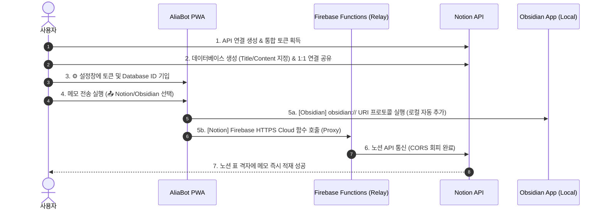

# 📝 Notion & Obsidian 연동 표준 운영 절차서 (VSOP)
## Phase 5.8: 모바일 PWA 환경 통합 연동 가이드

본 가이드는 사용자가 모바일 또는 노트북 환경에서 AliaBot PWA 비서 앱을 본인의 개인 Notion 데이터베이스 및 Obsidian Vault와 실시간 연동하여 데이터를 디스패칭(내보내기)할 수 있도록 정리된 시각적 표준 운영 매뉴얼입니다.

---

## 🏗️ 전체 연동 프로세스 인포그래픽 흐름도

---

## 📋 단계별 세부 수행 절차 (Screen-Mapped Action)

### [1단계] Notion API 연결(Connection) 생성 및 액세스 토큰 획득
1. 웹 브라우저에서 [Notion Developers Connections 포털](https://app.notion.com/developers/connections)로 접속하여 로그인합니다.
2. 파란색 **`+ 신규 연결`** 버튼을 클릭합니다.
3. 연결 이름란에 **`AliaBot`** 이라고 적고 저장을 완료합니다.
4. 화면에 생성된 **`내부 통합 토큰` (또는 비공개 액세스 토큰)**을 복사합니다.

> [!IMPORTANT]
> 토큰을 입력할 때는 맨 앞의 접두어인 **`ntn_`을 포함한 전체 문자열**을 그대로 복사하여 입력해야 합니다. 접두어가 빠지면 노션 보안 시스템이 인증 거부(401 Unauthorized)를 반환합니다.

#### 📸 설정 화면 캡처 레퍼런스

---

### [2단계] 메모를 보관할 표(Database) 생성 및 열 이름 설정
1. 본인의 노션 워크스페이스에 빈 페이지를 생성하고, 본문 입력창에서 **`/table`** 혹은 **`/표`**를 타이핑합니다.
2. 팝업 메뉴에서 단순 표 레이아웃 대신 **`표 보기 · 데이터베이스`** 항목을 클릭합니다.
3. 우측에 생성된 옅은 파란색의 **`새로 만들기`** 버튼을 클릭하여 완전한 표를 화면에 인스턴스화합니다.
   > [!CAUTION]
   > 일반 텍스트 문서 상단의 속성 추가 기능(`+ Add a property`)을 사용하면 안 되며, 반드시 본문 격자 형태의 **'표 보기 데이터베이스'**를 삽입하셔야 합니다.
4. 기본으로 생성되는 첫 번째 열인 **`Aa 이름`**을 클릭하고 이름을 **`Title`**로 변경합니다. (유형: 제목)
5. `Title` 열 헤더의 바로 오른쪽 옆에 있는 **`+` (플러스)** 아이콘을 클릭하여 새 열을 생성하고, 유형을 **`텍스트` (Text)** 로 설정한 뒤 이름을 **`Content`** 라고 수정합니다. (프로그램 상의 키값 매핑 목적)

#### 📸 표 구성 레퍼런스

---

### [3단계] 데이터베이스 ID 추출 및 권한 1:1 부여
1. 완성된 표의 링크를 복사하여 데이터베이스 ID(32자리 UUID)를 추출합니다:
   * 복사한 링크 예시: `https://www.notion.so/myworkspace/`**`394bed8a5dfd80e38e74d1c8295d156c`**`?v=...`
   * 중간에 들어간 32자리 문자열 `394bed8a5dfd80e38e74d1c8295d156c`가 **`Database ID`** 입니다.
2. **보안 권한 부여 (Connection Sharing)**:
   * 대상 페이지의 우측 최상단 **`공유`** ➡️ `연결 추가` 또는 **`점 3개 (···)`** ➡️ **`연결 추가`** 메뉴를 클릭합니다.
   * 검색창에 **`AliaBot`**을 타이핑하고, 자동 완성된 봇 계정을 클릭한 후 "이 페이지에 AliaBot 추가" 알림 창에서 **`확인`**을 누릅니다.
   > [!NOTE]
   > 이 과정을 누락하면 노션 API 전송 시 `Could not find database with ID...` 오류가 발생합니다. 링크가 있는 웹의 모든 사용자에게 전체 공개하지 않고 1:1 연결 추가를 통해서만 안전하게 통신 문을 개방해야 합니다.

#### 📸 권한 설정 화면 레퍼런스

---

### [4단계] AliaBot 설정 저장 및 전송 검증
1. AliaBot 대시보드의 우측 상단 **⚙️ 설정** 창을 클릭합니다.
2. 아래 정보를 각각 기입합니다:
   * **Notion API Token**: `ntn_`을 포함한 전체 API 토큰 기입
   * **Notion Database ID**: 추출한 32자리 문자열 기입
   * **Notion Title Property**: `Title`
   * **Notion Content Property**: `Content`
   * **Obsidian Vault Name**: `Winterbud-03MS` (사용자님의 옵시디언 보관소 이름)
3. 하단의 **`저장 및 닫기`** 버튼을 누릅니다.
4. 메모장에 `!노션 !옵시디언 새로운 PWA 프록시 연동 테스트`를 입력해 카드를 생성한 뒤, 내보내기(📤) 버튼을 눌러 두 채널을 선택하고 전송합니다.
5. 화면에 파란색 성공 마크와 함께 **`전송 완료: CLIPBOARD, NOTION, OBSIDIAN`** 팝업 메시지가 노출되는지 확인합니다.

#### 📸 비서 앱 설정창 레퍼런스

---

## 📱 모바일 실기 디바이스 최종 전송 연동 검증 (Mobile PWA Multi-Channel Verification)
실제 갤럭시 스마트폰에서 AliaBot PWA 앱을 기기 홈 화면에 추가한 후, 아래의 통합 연동 시나리오를 검증 완료했습니다:
1. **⚙️ 통합 설정 (Configuration)**: 모바일 환경에서 Notion Token, Database ID 및 Obsidian Vault 명칭(`Winterbud-03MS`)을 1회 설정하여 로컬 스토리지에 영구 저장했습니다.
2. **📤 4대 채널 일괄 디스패칭 (Multi-Channel Dispatching)**:
   * **Notion, Google Calendar, 이메일**: 터치 한 번으로 Vercel 배포 도메인 및 Cloud Functions 프록시 중계 파이프라인을 타고 각각의 타겟 클라우드 저장소에 성공적으로 적재됩니다.
   * **Obsidian (옵시디언)**: 내보내기 시 `obsidian://new?...` 딥링크 프로토콜 핸들러가 모바일 웹 브라우저의 mixed content 보안 샌드박스를 우회하여 네이티브 옵시디언 앱을 즉각 실행시키고 로컬 노트를 자동 생성합니다.

