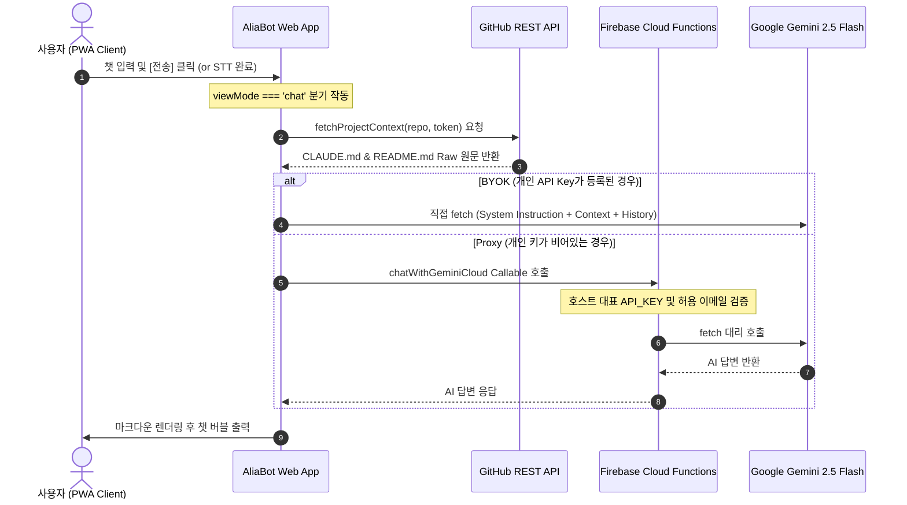

# 📝 AliaBot Conductor: Phase 6.0 Visual Tech Log (VTL)
## GitHub REST API & Gemini Proxy를 이용한 다중 프로젝트 브릿지(GitHub Project Chat Bridge) 연동 기술 로그

본 문서는 AliaBot Phase 6.0 세션에서 구현 완료된 **다중 프로젝트 브릿지(GitHub Project Chat Bridge)**의 설계 개념, 작동 원리, 데이터 흐름 및 UI 구현 방식을 상세히 정리하여 프로젝트 자산으로 보존하기 위한 기술 로그입니다.

---

## 1. 💡 배경 및 핵심 개념 (Background & Core Terminology)

### ① 다중 프로젝트 브릿지 (Multi-Project Bridge)
Claude Code나 Cursor 등의 별도 환경에서 관리되는 외부 프로젝트 지식 베이스(예: `Greenhouse-CropDataOps` 저장소 내 `CLAUDE.md`, `README.md` 등)를 AliaBot 비서와 직접 연동하는 데이터 브릿지입니다. AI가 해당 프로젝트의 핵심 가이드라인, 규칙 및 변수 선언 등을 완전히 학습한 상태에서 사용자의 질문에 답할 수 있습니다.

### ② 맥락 주입 (Context Injection)
대화 요청 시 깃허브에서 파일 내용을 실시간으로 가져와 AI의 `System Instruction` 하단에 배경 지식으로 끼워 넣어 전달하는 기법입니다. 이를 통해 AI가 정적 지식(Static Knowledge)에 머무르지 않고, 업데이트되는 프로젝트 정보(Dynamic Context)를 실시간 반영하여 정교하게 추론하도록 돕습니다.

### ③ 하이브리드 대리 호출 (Hybrid Proxy & BYOK)
사용자가 로컬 브라우저에 본인의 Gemini API 키를 등록(BYOK)했다면 클라이언트에서 직접 구글 게이트웨이를 호출하고, 비워두었다면 서버의 Cloud Functions(`chatWithGeminiCloud`)를 경유해 호스트 대표 API 키를 보안 안전망 하에 대리 호출하는 하이브리드 게이트웨이 아키텍처입니다.

---

## 2. 🏗️ 아키텍처 및 데이터 흐름 (Architecture & Data Flow)



---

## 3. 🛠️ 주요 소스 코드 구현체 (Core Code Structures)

### ① GitHub Raw File Fetcher (`src/api/github.js`)
GitHub API는 `Accept: application/vnd.github.v3.raw` 헤더를 지정해 전송하면 Base64 디코딩 없이 마크다운 원문을 즉각 취득할 수 있어 모바일 클라이언트 단에서 매우 효율적으로 동작합니다.

```javascript
export async function fetchGitHubFile(repo, path, token) {
  const url = `https://api.github.com/repos/${repo}/contents/${path}`;
  const headers = { 'Accept': 'application/vnd.github.v3.raw' };
  if (token) headers['Authorization'] = `token ${token}`;

  const response = await fetch(url, { method: 'GET', headers });
  if (!response.ok) throw new Error(`GitHub API 호출 실패 (${response.status})`);
  return response.text();
}
```

### ② Cloud Functions Proxy Chat API (`functions/index.js`)
서버리스 함수에서 허용된 이메일 계정 여부를 검증하고, Secret Manager의 호스트 API 키를 적재하여 사용자 히스토리와 깃허브 컨텍스트를 주입하는 프록시 대리 호출을 원활히 처리합니다.

```javascript
exports.chatWithGeminiCloud = onCall(
  { region: FUNCTION_REGION, secrets: [geminiApiKey] },
  async (request) => {
    if (!request.auth) throw new HttpsError('unauthenticated', '로그인이 필요합니다.');
    assertEmailAllowed(request.auth.token.email);

    const { message, context, history } = request.data || {};
    const apiKey = geminiApiKey.value();

    const systemInstruction = `당신은 사용자의 깃허브 프로젝트 지식을 완벽히 이해하는 프로젝트 비서입니다...
[프로젝트 컨텍스트]
${context || '제공된 컨텍스트가 없습니다.'}`;

    // ... 히스토리 포맷 정비 후 Gemini API fetch 수행 ...
    return { text: rawText };
  }
);
```

### ③ Vanilla JS Markdown Parser (`src/App.jsx`)
PWA 경량화 및 의존성 최소화를 위해, 마크다운의 제목, 볼드체, 인라인 코드, Catppuccin 스타일 코드 블록(`pre`, `code`), 순서 없는 리스트를 정규표현식(Regex)으로 정교하게 치환하는 `renderMarkdown` 헬퍼 함수를 적용했습니다.

```javascript
function renderMarkdown(text) {
    if (!text) return '';
    let html = text
        .replace(/&/g, '&amp;')
        .replace(/</g, '&lt;')
        .replace(/>/g, '&gt;')
        .replace(/```([\s\S]*?)```/g, '<pre style="..."><code>$1</code></pre>')
        .replace(/`([^`]+)`/g, '<code style="...">$1</code>')
        .replace(/\*\*([^*]+)\*\*/g, '<strong>$1</strong>')
        .replace(/^\s*-\s+(.+)$/gm, '<li style="...">$1</li>')
        .replace(/\n/g, '<br/>');
    
    return <div dangerouslySetInnerHTML={{ __html: html }} />;
}
```

---

## 4. 📈 트러블슈팅 및 설계 결정 사항 (Troubleshooting & Design Decisions)

### ① Firestore 실시간 채팅 영속화 (PWA 새로고침 대응)
* **문제**: 로컬 메모리 상태에 대화 기록을 유지하는 방식은 모바일 PWA 환경에서 백그라운드 리로드나 수동 리프레시 발생 시 대화 내역이 유실되는 중대한 한계가 있었습니다.
* **해결**: `users/${uid}/chatMessages` 컬렉션을 설계하여 Firestore에 대화를 영속화하고, `limit(100)` 정렬 쿼리로 구독하도록 아키텍처를 개선했습니다. 추가적으로 client-side 루프 삭제 기법을 통해 Firestore `getDocs` 임포트 누락 제약을 극복하고 [대화 비우기] 트랜잭션을 완벽하게 처리했습니다.

### ② 고정 입력창 및 마이크 STT 인프라 재활용
* **문제**: 채팅 전용 입력 폼을 하단에 개설할 경우, 모바일 키보드 팝업 시 화면 높이가 찌그러지고 기기별 STT 마이크 동작 흐름이 꼬일 수 있었습니다.
* **해결**: 화면 상단에 고정된 `app-fixed-top` 내 메인 입력창을 챗 뷰에서도 그대로 재사용하되, `viewMode === 'chat'` 상태일 때 `placeholder` 문구와 `add-btn` 라벨이 `[전송]`으로 가변 동작하도록 분기하여 복잡도를 획기적으로 낮추었습니다.
