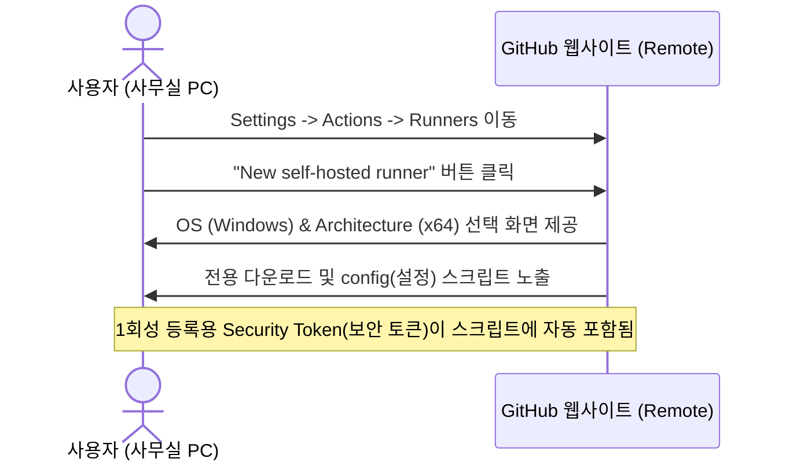
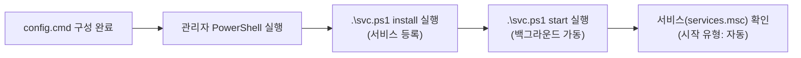

# 🖥️ AliaBot Local Runner: Self-hosted Runner Deployment VSOP
## 로컬 실행기 배포 및 윈도우 백그라운드 서비스 등록 절차서

본 문서는 사용자의 사무실 PC를 안전한 **Self-hosted Runner (자가 호스팅 실행기)**로 등록하고, 이를 **Windows Service (윈도우 서비스)**로 등록하여 부팅 시 자동으로 백그라운드에서 24시간 자율 가동하도록 설정하는 구체적인 표준 절차를 안내합니다.

---

## 1. ⚙️ 핵심 개념 및 작동 원리 (Terminology & Mechanism)

자가 호스팅 실행기를 구축하고 안정적으로 운영하기 위해 이해해야 할 핵심 네트워크 및 시스템 개념입니다.

### ① Self-hosted Runner (자가 호스팅 실행기)
* **개념**: GitHub가 제공하는 클라우드 가상 머신 대신, 사용자의 로컬 물리 컴퓨터(사무실 PC 등)에 실행기 프로그램을 직접 설치하여 GitHub Actions의 작업(Job)을 대리 수행하게 하는 에이전트 소프트웨어입니다.
* **작동 원리**: 로컬 PC 내부의 데이터베이스, 파일 시스템, 로컬에 설치된 LLM(대형 언어 모델) 인터페이스 등을 GitHub Actions 워크플로우가 직접 제어할 수 있게 연결 브릿지 역할을 수행합니다.

### ② Long-polling (롱 폴링 - 실시간 상태 감시 통신법)
* **개념**: 클라이언트가 서버에 연결을 요청한 뒤, 서버에 이벤트가 발생할 때까지 연결을 끊지 않고 유지하다가 신호가 오면 즉시 응답을 받아 처리하는 실시간 통신 방식입니다.
* **보안상 이점**: 로컬 Runner가 외부의 GitHub 서버로 먼저 접속을 시도하는 **Outbound Connection (아웃바운드 커넥션 - 내부에서 외부로 나가는 통신)** 방식을 사용하므로, 사무실 내부망 방화벽의 **Inbound Port (인바운드 포트 - 외부에서 내부로 들어오는 통신 경로)**를 열거나 포트 포워딩을 설정할 필요가 없어 보안상 극히 안전합니다.

### ③ Windows Service (윈도우 서비스 - 백그라운드 상시 가동 시스템)
* **개념**: 윈도우 운영체제에서 사용자가 직접 바탕화면에 로그인하여 터미널 창을 켜두지 않더라도, 시스템이 부팅되는 시점부터 백그라운드에서 조용히 실행되는 독립적인 프로세스 가동 방식입니다.
* **필요성**: PC가 재부팅되거나 사용자가 로그아웃하더라도 AliaBot 자동화 명령 수신 대기 상태를 상시 유지하기 위해 반드시 이 서비스 형태로 구동해야 합니다.

---

## 2. 🌐 GitHub 웹사이트에서 Runner 등록 명령어 발급받기

우선 GitHub 리포지토리(저장소) 측에 자가 호스팅 실행기를 신규 등록하고, 전용 보안 토큰이 포함된 설치 스크립트를 확인하는 단계입니다.



### 📋 상세 이동 및 발급 경로
1. 본인의 **GitHub Repository (원격 저장소)** 웹페이지에 접속합니다.
2. 상단 탭 메뉴 우측의 **Settings (설정)** 톱니바퀴 아이콘을 클릭합니다.
3. 좌측 사이드바 메뉴에서 **Actions (액션)** 항목을 확장한 후, **Runners (실행기)** 메뉴를 클릭합니다.
4. 우측 상단의 녹색 **"New self-hosted runner" (새 자가 호스팅 실행기)** 버튼을 클릭합니다.
5. **Runner image (실행기 이미지 OS)** 선택에서 **Windows**를 선택합니다.
6. **Architecture (아키텍처)** 선택에서 **x64**를 선택합니다.
7. 아래에 나타나는 **Download (다운로드)** 및 **Configure (설정)** 명령어 박스를 차례대로 복사하여 실행 준비를 합니다.

---

## 3. 🛠️ PowerShell을 통한 다운로드 및 구성 절차

사무실 PC에서 **PowerShell (파워쉘)**을 실행하여 Runner 패키지를 다운로드하고 설정하는 절차입니다. 

> [!IMPORTANT]
> Runner 프로그램 설치 경로에 띄어쓰기(공백)나 특수문자가 포함될 경우 스크립트 실행 오류가 발생할 수 있으므로, `C:\actions-runner`와 같이 명확하고 공백이 없는 루트 폴더에 설치하는 것을 강력히 권장합니다.

### ① 다운로드 및 압축 해제 (Download & Extract)
관리자 권한으로 PowerShell을 열고 다음 순서대로 실행합니다. (GitHub 웹페이지의 명령어 복사 기능 사용 권장)

```powershell
# 1. 설치할 루트 폴더 생성 및 이동
New-Item -Path "C:\" -Name "actions-runner" -ItemType "directory" -Force
Set-Location -Path "C:\actions-runner"

# 2. GitHub Actions Runner 다운로드 (버전은 다운로드 시점의 최신 버전으로 자동 생성됨)
Invoke-WebRequest -Uri "https://github.com/actions/runner/releases/download/vX.Y.Z/actions-runner-win-x64-X.Y.Z.zip" -OutFile "actions-runner-win-x64-X.Y.Z.zip"

# 3. 해시 검증 (파일 무결성 체크)
# (GitHub 웹페이지의 해시값과 비교)
# Get-FileHash -Path .\actions-runner-win-x64-X.Y.Z.zip

# 4. 압축 해제
Expand-Archive -Path ".\actions-runner-win-x64-X.Y.Z.zip" -DestinationPath "." -Force
```

### ② 실행기 구성 및 등록 설정 (Configure & Register)
다운로드가 완료되면 다음 명령을 입력하여 실행기 프로그램을 원격 저장소에 정식 등록합니다.

```powershell
# 구성 스크립트 실행
.\config.cmd --url https://github.com/사용자아이디/저장소이름 --token 발급받은보안토큰
```

* 실행 도중 **Interactive Shell (대화형 쉘)** 창에서 다음과 같은 질문이 나옵니다.
  1. **Enter the name of the runner group to add this runner to:**  
     👉 그냥 `Enter` 키를 눌러 `Default`로 지정합니다.
  2. **Enter the name of runner:**  
     👉 사무실 PC를 구별하기 좋은 이름(예: `office-desktop`)을 입력하거나 `Enter`를 쳐서 기본값을 씁니다.
  3. **Enter any additional labels (comma-separated):**  
     👉 워크플로우 파일(`aliabot-orchestrator.yml`)의 `runs-on` 지정값과 일치하도록 태그를 입력합니다. (예: `self-hosted, office-pc` 등)
  4. **Enter name of work folder:**  
     👉 그냥 `Enter` 키를 눌러 `_work` 기본 폴더를 사용합니다.

---

## 4. ⚙️ Windows Service 백그라운드 등록 및 구동 절차

구성이 완료된 실행기를 터미널 창을 닫아도 백그라운드에서 자동 구동되게끔 **Windows Service (윈도우 서비스)**로 정식 등록하는 핵심 단계입니다.



### 📋 서비스 등록 파워쉘 명령어

반드시 **관리자 권한 (Administrator Privilege)**으로 가동된 PowerShell 창에서 `C:\actions-runner` 폴더로 이동한 뒤 아래 명령어를 한 줄씩 실행합니다.

```powershell
# 1. Runner 폴더로 이동
Set-Location -Path "C:\actions-runner"

# 2. Windows Service 등록 (Install)
# 이 스크립트는 Runner 폴더 내에 기본 포함된 공식 서비스 등록 도구입니다.
.\svc.ps1 install

# 3. 서비스 구동 시작 (Start)
.\svc.ps1 start
```

### 🔍 서비스 구동 상태 검증 방법
서비스가 성공적으로 실행되었는지 윈도우 시스템에서 물리적으로 교차 검증하는 방법입니다.

1. 키보드의 `Win + R` 키를 눌러 **실행** 창을 켭니다.
2. `services.msc`를 입력하고 엔터를 눌러 **서비스** 관리 도구를 엽니다.
3. 목록에서 **"GitHub Actions Runner (사용자_저장소_지정이름)"** 형태의 서비스를 찾습니다.
4. **상태**가 `실행 중`이고, **시작 유형**이 `자동`으로 되어 있는지 확인합니다.
5. GitHub 리포지토리의 `Settings -> Actions -> Runners` 페이지로 새로고침하여 들어갔을 때, 등록한 Runner의 상태 표시등이 초록색 **Idle (대기 중)** 또는 **Active (활성 상태)**로 정상 표시되는지 검증합니다.

---

## 5. ⚠️ 문제 해결 및 유지보수 가이드 (Troubleshooting)

### ① 권한 에러 (Access Denied / Execution Policy)
* **현상**: `.\svc.ps1` 또는 `.\config.cmd` 실행 시 권한 부족 에러나 스크립트 실행 제한 경고가 발생할 때.
* **대책**: PowerShell에서 로컬 스크립트 실행이 허용되도록 관리자 권한 터미널에서 다음 명령을 수행해 줍니다.
  ```powershell
  Set-ExecutionPolicy -ExecutionPolicy RemoteSigned -Scope Process -Force
  ```

### ② 서비스 정지 및 삭제가 필요할 때
* **절차**: 유지보수나 Runner 재등록을 위해 서비스를 안전하게 정지하고 삭제해야 할 경우 다음 명령을 사용합니다.
  ```powershell
  # 서비스 일시 정지
  .\svc.ps1 stop
  
  # 서비스 등록 해제 (Uninstall)
  .\svc.ps1 uninstall
  ```
