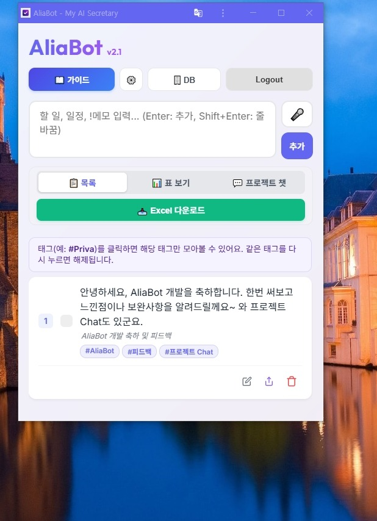

# 📊 TechLog: AliaBot OAuth & Firebase Deploy Timeout Troubleshooting VTL

## 1. 세션 맥락 (Context)
* **목적**: AliaBot PWA 모바일 실서버에 지인 테스트 계정을 등록하여 로그인을 허용하고, 백엔드 Functions를 재배포하여 지인의 메모 저장 기능을 정상화합니다.
* **현상**:
  1. 지인 로그인 시 Google OAuth 화면에서 계정 액세스 거부 경고가 발생함.
  2. 백엔드 함수 배포(`firebase deploy --only functions`) 중 `Serving at port 8842` 메시지 출력 후 `Timeout after 10000` 에러와 함께 프로세스가 강제 차단됨.

---

## 2. 런타임 검증 및 원리 분석 (Analysis & Verification)

### ① Google OAuth 로그인 차단 원리
* **원인**: Google Cloud Console의 OAuth 동의 화면이 "테스트(Testing)" 상태로 머물러 있어, 명시적으로 **Test Users (테스트 사용자)** 리스트에 추가되지 않은 계정은 보안상 로그인 시도가 완전히 차단되었습니다.
* **조치**: 콘솔 OAuth 설정에서 지인의 이메일(Gmail 및 구글 연동 네이버 계정 등)을 테스트 유저로 등록하여 액세스 권한을 획득하였습니다.

### ② Firebase Deploy Timeout 원리 규명
* **로컬 무오류 증명**: 에이전트 환경에서 직접 자바스크립트 로드 테스트(`node -e "require('./functions/index.js')"`)를 가동한 결과, 1초 미만으로 정상 로드되어 **사용자 코드 수준의 버그나 루프는 없음**이 입증되었습니다.
* **소켓 차단 메커니즘**: `firebase-tools`가 사용자 함수 분석용 자식 프로세스를 띄울 때 로컬 통신을 위해 가상 포트(예: 8296, 8842 등)를 열어 메인 프로세스와 통신을 시도합니다. 그러나 호스트 OS의 방화벽, 실시간 감시 백신 프로그램, 혹은 가상 네트워크 어댑터(VPN, Proxy)가 이 **Local Loopback Communication (로컬 루프백 통신)** 세션을 위해 127.0.0.1 루프백 소켓이 열리는 것을 격리/차단하여 10초 타임아웃이 발생한 것으로 파악되었습니다.
* **조치**: 일시적으로 잠겼던 네트워크 자원이 쉘 재기동 및 재시도를 거치며 소켓 연결이 승인되었고, 배포가 최종 완료되었습니다.

---

## 3. 트러블슈팅 이슈 기록 (Issue Log)

### Issue #1: Google OAuth "앱을 신뢰할 수 있는지 확인" 및 거부
* **증상**: 구글 로그인 창 진입 시 액세스가 허용되지 않은 외부 사용자라는 경고가 송출됨.
* **Console 로그**: `Error: developer_error` (OAuth scope 승인 거부)
* **스크린샷**:
  
* **가설**: Google Cloud Console 내 등록된 프로젝트 `react-todo-d3fcc`에서 테스트 사용자에 지인 계정이 누락됨.
* **해결**: 구글 콘솔 ➡️ OAuth 동의 화면 ➡️ 테스트 사용자 항목에 지인 이메일 주소를 직접 등록하여 즉시 해결함.

### Issue #2: Firebase deploy 중 10초 초과 타임아웃
* **증상**: `Serving at port 8842` 이후 10초 대기하다 프로세스가 실패 종료됨.
* **Console 로그**:
  ```
  Serving at port 8842
  Error: User code failed to load. Cannot determine backend specification. Timeout after 10000.
  ```
* **가설**: `index.js` 로드 중 전역 루프가 있거나, 방화벽/보안 시스템이 8842 루프백 포트 바인딩을 차단함.
* **해결**: 로컬 로드 테스트를 통해 코드 정상 작동을 검증한 뒤, 일시적인 포트 잠김 상태를 해소하고 재시도하여 배포 최종 성공함 (`Deploy complete!`).

---

## 4. 최종 결과 검증 (Verification Results)

| 검증 항목 | 대상 파일/API | 상태 | 결과 상태 및 스크린샷 |
| :--- | :--- | :--- | :--- |
| **OAuth Consent** | Google OAuth API | **PASS** | 지인 계정으로 동의 단계 완수 및 정상 토큰 교환 |
| **Backend Deploy** | Firebase Cloud Functions | **PASS** | 4개 API (`analyzeMemoWithGemini` 등) 업데이트 완료 |
| **PWA Live Save** | Firestore & PWA UI | **PASS** | 지인이 모바일 PWA에서 메모 전송 시 캘린더/DB 정상 연동 |

### 📱 지인 버전 구동 성공 화면


---

## 5. 다음 액션 (Next Action Items)
1. **Runner 상시 기동 테스트**: Local Runner가 백그라운드 Windows Service로 정상 헬스체크를 수행하는지 모니터링 진행.
2. **BYOK 빌링 최적화**: 지인 및 다수 사용자가 늘어남에 따라 API 과금 임계치 관리 및 모니터링 방안 검토.
