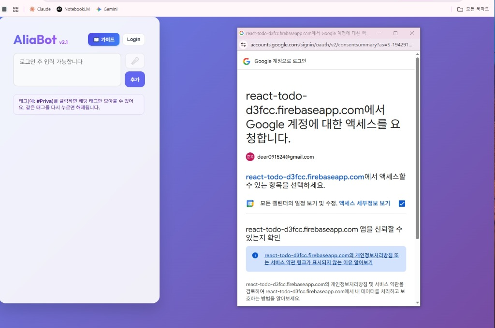

# 📖 VSOP: 구글 콘솔 프로젝트 구별 및 테스트 사용자 등록 가이드

> **대상**: 비개발자 운영자 및 초기 세팅 복원 작업자  
> **소요 시간**: 약 10분  
> **준비물**: Google Cloud Console 개발자 계정 권한, 에디터 및 터미널 환경

---

## 1. ⚙️ 핵심 개념 및 작동 원리 (Terminology & Mechanism)

### ① Project ID vs Project Display Name (프로젝트 식별자와 표시명)
* **개념**: 구글 클라우드와 파이어베이스에서 프로젝트를 식별할 때 컴퓨터가 읽는 **고유 ID (Identifier)**와 사람이 편하게 읽는 **표시용 이름 (Display Name)**은 다르게 관리됩니다.
* **원리**: 
  - 본 프로젝트는 최초에 `React To-Do List`라는 표시명으로 만들어졌으며, 고유 ID는 `react-todo-d3fcc`로 결정되었습니다.
  - 이후 내부 컨텐츠와 로직을 비서 앱인 `AliaBot`으로 변경하고 파이어베이스 설정에서 별칭을 부여했지만, 시스템의 물리적인 원천인 Google Cloud Console 등에서는 최초 고유 ID인 **`react-todo-d3fcc`**가 계속해서 프로젝트명으로 표시됩니다.
  - 따라서 구글 클라우드 콘솔에 접속했을 때 "AliaBot"이 보이지 않더라도, **`React To-Do List (react-todo-d3fcc)`**를 선택하고 진입하는 것이 올바른 원천 프로젝트 접근법입니다.

### ② OAuth Testing Mode & Allowlist (OAuth 테스팅 모드와 허용 목록)
* **개념**: 외부 제3자 검수가 완료되기 전에, 개발 중인 애플리케이션의 구글 로그인 기능을 미리 등록된 소수의 인원에게만 한시적으로 허용하는 보안 장벽입니다.
* **원리**: 구글 OAuth 동의 화면이 "테스트" 상태인 경우, 구글의 보안 정책에 따라 오직 **Test Users (테스트 사용자)** 목록에 등록된 이메일 주소만 해당 앱에 구글 로그인을 수행할 수 있도록 방어합니다.

---

## 2. 📋 Step-by-Step 실행 절차 (Instructions)

### Step 1: Google Cloud Console 접속 및 프로젝트 식별
1. [Google Cloud Console](https://console.cloud.google.com/)에 개발자 계정으로 접속합니다.
2. 좌측 상단 프로젝트 선택 드롭다운 메뉴를 클릭합니다.
3. 표시명이 `React To-Do List`로 뜨더라도 아래의 고유 ID가 **`react-todo-d3fcc`**인 항목을 찾아 선택합니다.
   * *주의: Aliabot Dev 등의 임시 프로젝트와 혼동하지 마십시오.*

---

### Step 2: OAuth 테스트 사용자 등록 (지인 메일 등록)
1. 왼쪽 메뉴판에서 **[API 및 서비스] ➡️ [OAuth 동의 화면]** 메뉴로 진입합니다.
2. 스크롤을 중간 이하로 내려 **[Test Users (테스트 사용자)]** 섹션으로 이동합니다.
3. **[+ ADD USERS (사용자 추가)]** 버튼을 클릭합니다.
4. 추가할 지인의 이메일 주소를 입력합니다. (쉼표로 구분하여 다중 입력 가능)
   * *네이버 메일 주소(`winterbud7@naver.com` 등)라도 해당 이메일로 구글 계정에 회원가입이 되어 있다면 등록이 가능합니다.*
5. **[저장]**을 눌러 반영을 완료합니다.



---

### Step 3: 로컬 및 백엔드 환경 변수 동기화
새로 초대된 지인의 이메일을 소스코드 내 허용 목록(Allowlist)에도 반영해 주어야 백엔드가 최종적으로 저장을 허용합니다.

1. 로컬 설정 파일 [.env](file:///c:/Users/eugene/Projects/Work01_Anti/.env)을 엽니다.
   * `VITE_ALLOWED_EMAILS` 값에 지인의 이메일을 쉼표(`,`)로 구분하여 추가합니다.
2. 백엔드 함수 설정 파일 [functions/.env](file:///c:/Users/eugene/Projects/Work01_Anti/functions/.env)을 엽니다.
   * `ALLOWED_EMAILS` 값에 지인의 이메일을 동일하게 복사하여 붙여넣습니다.

---

### Step 4: 파이어베이스 백엔드 함수 배포 실행
1. 에디터 하단의 통합 터미널을 열고 프롬프트 시작 경로가 `C:\Users\eugene\Projects\Work01_Anti`인지 확인합니다.
2. 아래 명령어를 실행하여 변경된 허용 목록을 Firebase 서버에 정식 배포합니다:
   ```powershell
   firebase deploy --only functions
   ```
3. 터미널 창에 `Deploy complete!` 문구가 표시되면 모든 설정이 정상 완료된 것입니다.

---

## 3. ❓ 실패 시 FAQ (Troubleshooting Table)

| 발생 증상 | 예상 원인 | 확인 및 해결 방법 |
| :--- | :--- | :--- |
| **구글 로그인 시 "개발자에게 문의" 에러 발생** | OAuth 테스트 사용자 목록에 이메일이 오타로 등록되었거나 미등록됨 | Google Cloud Console의 `Test Users` 리스트에 정확한 철자로 추가되었는지 재검토하십시오. |
| **로그인은 되나 할 일/메모 추가 시 저장 실패** | `functions/.env` 파일의 이메일 허용 목록이 갱신되지 않았거나 배포가 유실됨 | `functions/.env` 수정 후 `firebase deploy --only functions`가 성공적으로 끝났는지 재배포해 보십시오. |
| **PWA 설치 아이콘이 뜨지 않음** | 구버전 서비스 워커의 캐시 정체 또는 브라우저의 PWA 감지 딜레이 | 브라우저 설정에서 캐시/쿠키를 지우고 페이지를 새로 고침하거나 기기 부팅을 시도하십시오. |
