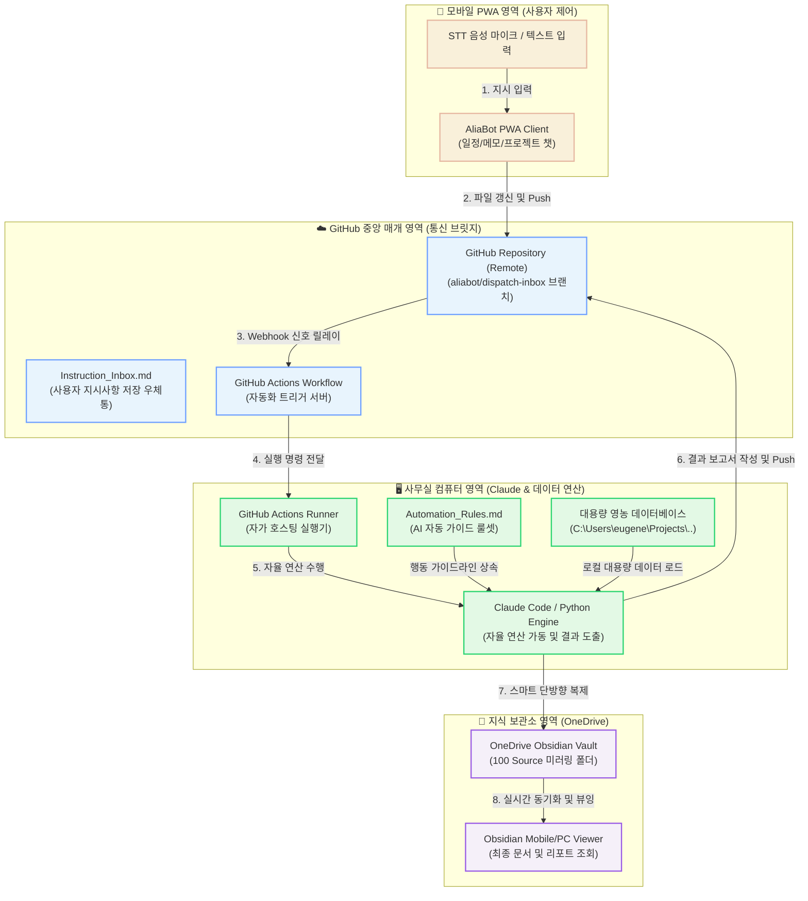

# 🗺️ AliaBot Conductor: Multi-Project Orchestration Master Blueprint (VSOP)
## 다중 프로젝트 통합 지휘 및 자율화 연동 마스터 청사진 (비주얼 표준 절차서)

본 문서는 AliaBot이 다중 개발 프로젝트(Greenhouse Crop Data, Priva 환경 제어 등)의 정보와 자원을 조율하고, 모바일 PWA 환경과 사무실 데스크탑 환경의 AI 에이전트들을 유기적으로 결합하여 작동시키는 **전체 아키텍처 흐름도(Master Map)**이자 종합 이정표 가이드라인입니다.

---

## 1. ⚙️ 핵심 개념 및 작동 원리 (Terminology & Mechanism)

### ① 오케스트레이션 허브 (Orchestration Hub - 통합 지휘 본부)
* **개념**: 모바일 비서 앱(AliaBot PWA)이 일방적인 일정/메모 수집기를 넘어, 깃허브와 클라우드 스토리지를 중앙 매개체로 삼아 다른 장치에서 일하는 AI 에이전트(Claude 등)들에게 명령을 하달하고 결과를 수집해 오는 지휘 체계입니다.

### ② 자가 호스팅 실행기 (Self-hosted Runner - 자가 실행 장치)
* **개념**: 월 비용이 드는 외부 클라우드 컴퓨터 대신, 상시 구동 중인 사무실 컴퓨터를 깃허브의 원격 하수인 에이전트로 등록하여 자가 연산 서버처럼 가동하는 연동 기술입니다.

### ③ 단방향 스마트 미러링 (One-way Smart Mirroring - 단방향 일치화)
* **개념**: 버전 충돌을 방지하기 위해, 깃허브에서 내려받은 최신 문서를 파워쉘 자동화 스크립트가 MD5 해시값을 비교하여 오직 로컬 프로젝트에서 OneDrive(Obsidian) 영역으로만 단방향으로만 복제하여 안전하게 뷰어로 보는 데이터 전파 흐름입니다.

---

## 2. 🗺️ 총괄 비주얼 아키텍처 흐름도 (Orchestration Flow Map)

AliaBot을 필두로 모바일 기기, GitHub, 그리고 사무실 PC(로컬 데이터 & Claude)가 어떻게 유기적으로 연동하여 자동화를 완성하는지 나타낸 전체 구조도입니다.

---

## 3. 🚦 단계별 자율 운영 규칙 (Operational Rules)

1. **지시 등록 단계 (Input & Push)**:
   * 사용자가 모바일 PWA에서 프로젝트 챗 모드로 지시를 내리면, 깃허브의 격리 브랜치 내에 작성된 `Instruction_Inbox.md` 파일 끝에 누적 추가됩니다.
2. **자가 감지 및 자율 연산 단계 (Trigger & Execution)**:
   * 깃허브가 사무실 컴퓨터에 구동 중인 Runner 프로그램에 자동화 명령을 송신합니다.
   * Runner 프로그램은 `Docs/Automation_Rules.md` 지침에 따라 로컬 PC 내의 파이썬 분석 프로그램과 Claude를 구동해 데이터 처리를 수행하고 보고서를 완성합니다.
3. **단방향 전파 및 확인 단계 (Sync & Viewing)**:
   * 연산 완료 후 생성된 산출물은 깃허브 원격지로 자동 push되며, 동시에 로컬 파워쉘 스크립트(`sync-to-obsidian.ps1`)가 MD5 해시 대조를 통해 오직 **로컬 ➡️ OneDrive Obsidian** 단방향으로 전파하여, 사용자가 옵시디언 뷰어로 최종 안전하게 확인하도록 돕습니다.

---

## 4. 🗂️ 세부 SOP / VTL 참조 이정표 (SOP & VTL Reference Map)

구체적인 구축 방법론이나 세부 문제해결이 필요할 때, 전체 그림을 보며 찾을 수 있는 마스터 참조 테이블입니다.

| 세부 운영 영역 | 관련 표준 문서 (SOP / VTL) | 핵심 요약 및 활용 목적 |
| :--- | :--- | :--- |
| **프로젝트 챗 및 REST API** | [Phase 6.0 VTL](file:///c:/Users/eugene/Projects/Work01_Anti/Docs/20260707_AliaBot_Phase60_GitHub_Project_Chat_Bridge_VTL.md) | 모바일 클라이언트에서 깃허브 API를 긁어오고 챗 렌더링을 처리하는 프론트엔드 연동 원리 기록 |
| **에이전트 제어 및 리네임** | [Agent Manager VSOP](file:///c:/Users/eugene/Projects/Work01_Anti/Docs/20260708_Antigravity_Agent_Manager_VSOP.md) | 에이전트 매니저 대시보드의 조작법, 세션명 정리 및 메인 에디터(`Ctrl+E`) 복귀 가이드 |
| **백그라운드 자동화 방식** | [Automation Plan](file:///c:/Users/eugene/Projects/Work01_Anti/Docs/20260708_AliaBot_Automation_Architecture_Comparison_Plan.md) | AWS EC2 가상 머신 임대안과 24시간 로컬 PC Actions Runner 활용안의 장단점 및 난이도 상세 분석 기획서 |
| **로컬 실행기 등록 및 구동** | [Local Runner VSOP](file:///c:/Users/eugene/Projects/Work01_Anti/Docs/20260708_AliaBot_Local_Runner_Deployment_VSOP.md) | 사무실 PC를 GitHub Actions Self-hosted Runner로 등록하고 Windows Service로 상시 가동하는 절차 |
| **서버 빌링 및 과금 전략** | [API Billing Plan](file:///c:/Users/eugene/Projects/Work01_Anti/Docs/20260708_AliaBot_API_Billing_Architecture_Plan.md) | 개발자 고유 API Key 대리 호출 방식에서 일반 배포용 개인 자가 Key 입력(BYOK) 하이브리드로의 고도화 로드맵 |
| **다중 기기 문서 미러링** | [MultiDevice Sync VSOP](file:///c:/Users/eugene/Projects/Work01_Anti/Docs/20260625_AliaBot_MultiDevice_Sync_VSOP.md) | 윈도우 전원 관리 최적화, OneDrive의 파일 락을 회피하며 로컬 프로젝트 문서를 옵시디언으로 이관하는 규칙 |
| **스마트 동기화 스크립트** | [Obsidian Sync SOP](file:///c:/Users/eugene/Projects/Work01_Anti/Docs/20260617_AliaBot_Phase5_Obsidian_Sync_SOP.md) | 로컬 `Docs/` 파일의 MD5 해시값을 비교하여 변경된 마크다운만 옵시디언 볼트로 실시간 백필하는 스크립트 운용 가이드 |
| **마스터 기억 보존** | [Agent Memory Master](file:///c:/Users/eugene/Projects/Work01_Anti/Docs/Agent_Memory.md) | 미래의 후속 AI 에이전트가 코딩 작업에 착수할 때 최우선으로 준수해야 하는 AliaBot 아키텍처 및 철학 안내 지침 |
