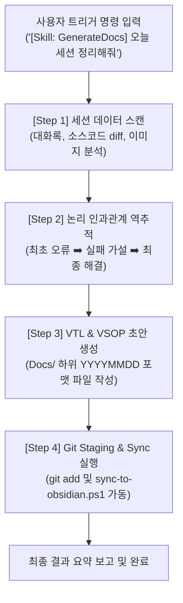

# 🤖 [Skill] VSOP & VTL Generate Skill Specification
## AI 에이전트 전용 자율 세션 복기 및 시각적 기술 문서 자동 편찬 스킬

본 문서는 AI 에이전트(Antigravity, Cursor, Claude Code 등)가 세션 완료 후 사용자의 수동 개입을 최소화하고, 당일 수행한 트러블슈팅 과정과 성공 절차를 스스로 추론·복기하여 완벽한 **VTL (과정 기록)** 및 **VSOP (따라하기 절차서)** 문서를 자동 컴파일할 수 있도록 설계된 에이전트 행동 지침 스킬 파일입니다.

---

## 1. ⚙️ 핵심 개념 및 작동 원리 (Terminology & Mechanism)

AI 에이전트가 지시 없이도 자율적으로 고품질 문서를 편찬할 수 있게 만드는 스킬의 핵심 매커니즘입니다.

### ① Autonomous Session Review (자율 세션 복기)
* **개념**: AI 에이전트가 단일 세션 대화창에 축적된 대화 맥락, 사용자가 제공한 Console Log (콘솔 로그) 및 스크린샷 이미지, 그리고 에디터의 소스 코드 수정 내역(git diff)을 종합 검사하여 문제 해결의 전말을 역추적해내는 기술입니다.
* **원리**: 대화 이력의 "처음 에러 발생 시점" ➡️ "시도한 가설과 실패 원인" ➡️ "최종 성공 로그"의 타임라인을 파싱하여 논리적 인과관계를 완성합니다.

### ② Dynamic Document Compiling (동적 문서 컴파일)
* **개념**: 수집된 맥락 데이터를 사전에 약속된 VTL/VSOP 마크다운 서식 템플릿에 맞추어, 요약이나 생략 없이 초상세 규격으로 조립·생성하는 자동화 편집 엔진입니다.
* **원리**: Frontmatter(프론트매터) 정보 자동 추출, 윈도우 OS 수준의 실패 원리 기입, 비개발자 타깃의 번호식 Step 설명 및 터미널 명령어 원문 스니펫 자동 맵핑을 일괄 수행합니다.

### ③ One-way Sync Mirroring (단방향 동기화 미러링)
* **개념**: 완성된 마스터 문서를 로컬 Git 저장소(`Docs/`)에 안전하게 저장한 뒤, 파워쉘 스크립트를 호출하여 클라우드 백업 공간(OneDrive Obsidian Vault)에 중복 충돌 없이 단방향 복제하는 연동 기작입니다.

---

## 2. 🗺️ 자율 문서화 가동 워크플로우 (Documentation Workflow)



---

## 3. 📝 세부 구현 가이드라인 (Implementation Rules)

스킬을 상속받은 에이전트는 문서 작성 시 아래 4대 구성 요소를 생략 없이 완벽히 서술해야 합니다.

### Rule 1: 물리 경로 및 ID의 절대 명시
* 복원 및 설정의 주체인 프로젝트와 시스템 파일들의 실제 절대 경로를 상세히 기재합니다.
* 예시:
  * Firebase Project ID: `react-todo-d3fcc`
  * 로컬 환경 변수: `C:\Users\eugene\Projects\Work01_Anti\.env`
  * 백엔드 환경 변수: `C:\Users\eugene\Projects\Work01_Anti\functions\.env`

### Rule 2: 실패 가설의 윈도우 OS 수준 원리 규명
* 단순히 "배포 실패함"으로 퉁치지 않고, "관리자 모드로 띄워진 파워쉘의 기본 시작 경로가 `C:\WINDOWS\system32`로 격리되어 Firebase 설정 파일들을 찾지 못했기 때문"과 같이 발생 현상의 OS적/네트워크적 원인을 논리적으로 밝혀 적습니다.

### Rule 3: 복사-붙여넣기 전용 명령어 스니펫 제공
* 사용자가 터미널에 복사하여 바로 실행할 수 있도록 명령어의 전체 구문을 수록합니다.
* 예시: `cd C:\Users\eugene\Projects\Work01_Anti` ➡️ `firebase deploy --only functions`

### Rule 4: 스크린샷 맵핑
* 사용자가 채팅창에 제공한 이미지 파일(`*.png`, `*.jpg`)의 특징을 추출하고, 저장된 경로(`Docs/Screenshots/YYYYMM/...`)를 기반으로 마크다운 내 이미지 삽입 문법을 적절한 순서도 Step에 자동 임베딩합니다.

---

## 4. 🚀 자율 문서화 작동을 위한 AI 프롬프트 프로토콜 (Prompt Trigger)

사용자가 다음과 같이 한 줄로 이 스킬의 가동을 트리거하면, 에이전트는 본 명세서(`Docs/VSOP_VTL_Generate_Skill.md`)를 탑재하여 자율 연산을 수행합니다.

### 📥 Trigger Command (호출 명령어 예시)
```markdown
[Skill: GenerateDocs]
오늘 세션에서 해결한 구글 로그인 경고 차단과 파이어베이스 함수 배포 문제에 대해, 
VSOP_VTL_Generate_Skill 규칙을 로딩하여 VTL 및 VSOP 문서를 각각 생성하고 
깃 스테이징 및 옵시디언 동기화까지 원스톱으로 처리해 줘.
```

### ⚙️ 에이전트 자율 연산 절차 (Agent Internal Execution Flow)
1. **Context Parsing**: 본 지침서의 `Frontmatter` 템플릿과 본문 구성 원칙을 파싱합니다.
2. **Data Scraping**: 대화 역사에서 `firebase deploy` 실패 기록, `system32` 경로 충돌, `react-todo-d3fcc` ID 정보, 그리고 사용자가 업로드한 구글 콘솔 대상 스크린샷 2장을 인덱싱합니다.
3. **Document Authoring**:
   - `Docs/YYYYMMDD_AliaBot_OAuth_Deploy_Fail_VTL.md` 작성
   - `Docs/YYYYMMDD_AliaBot_OAuth_Testing_User_Setup_VSOP.md` 작성
4. **Git & Sync Action**:
   - `git add` 명령 제안.
   - `powershell -File Docs/sync-to-obsidian.ps1` 명령을 Propose하여 사용자의 원클릭 승인 유도.
